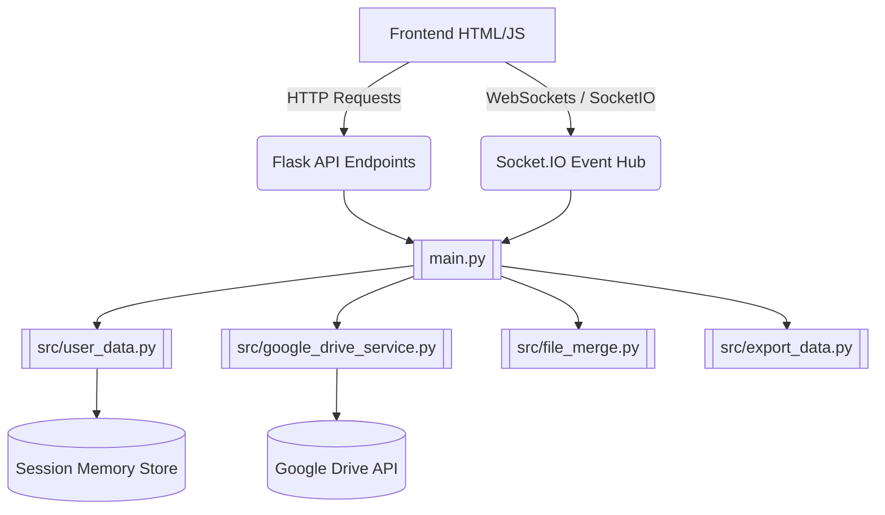

# Codebase Map & Logic (Online Branch)

This file serves as the primary orientation for the Antigravity agent regarding the **Online** branch of the `microalbumin-Flask` repository.

## Project Overview
The `online` branch contains the **Cloud Hosted Web Application** (Easy OKAPI).
It is a Flask-based web application deployed on online hosts (e.g., Heroku via `gunicorn`). Unlike the `main` branch, this version is decoupled from physical hardware (PyBadge). 

Instead of reading a local USB port, the application gets its data through:
1. Direct User File Uploads (`.csv` and `.json` standard curves).
2. Google Drive Integration (syncing sessions and folders).

The application provides a Web GUI for users to:
1. Browse their uploaded data or Google Drive synced `.csv` data (kept in an in-memory or pseudo-virtual database instead of the server's local file system).
2. Conduct analysis and generate Standard Curves (`kinetics`, `point`, `calibrate`).
3. View dynamically generated HTML dashboard plots using Socket.IO updates for live responsiveness across sessions.

## Architecture & Relationships

## Core Application Structure
- [[main.py]]: The main Flask entry point. Hosts endpoints for file uploads, Google OAuth2, Google Drive syncing, and serves the index HTML via Socket.IO for real-time reactivity.
- `src/`: Contains Python utility functions adapted for cloud usage:
  - [[src/user_data.py|user_data.py]]: Manages isolated sessions, Drive preferences, and virtual file stores to keep multiple users' uploaded data separate.
  - [[src/google_drive_service.py|google_drive_service.py]]: Handles Google OAuth callbacks and Drive folder retrieval/syncing.
  - [[src/file_merge.py|file_merge.py]] / [[src/export_data.py|export_data.py]]: Functions to manipulate `.csv`/`.json` arrays strictly in-memory.
- `static/script/`: Vanilla JavaScript handling the frontend functionality:
  - No hardware HID logic.
  - WebSockets logic for `update_csv` or `update_json` events.
  - Integration with Drive UI elements.
- Deployment Files: [[Procfile]], [[runtime.txt]], [[package.json]], and [[build.js]] indicate a build action sequence for deploying to platforms like Heroku.

## Critical State & Distinctions
- **Public Sandbox Environment**: The filesystem paths used in standard endpoints actually map to session-based data handling rather than physically scanning `/log/` or `/csv/`, avoiding cross-user pollution.
- **No Hardware Endpoints**: Since this is a public cloud instance, it cannot (and shouldn't) connect to physical COM/Serial ports. Thus, the hardware scripts are removed entirely.
- **Global State / Caching**: Driven through memory dictionaries mapping `session_id`s, as well as emitting changes via `flask_socketio` to update the frontend asynchronously.
- **Node.js Build Step**: Although mostly Python, it uses `npm` (`terser`) to minify and obfuscate its client JS before deployment.

*Note: For the local desktop application codebase acting directly via USB with the colorimeter, refer to the `main` branch.*
