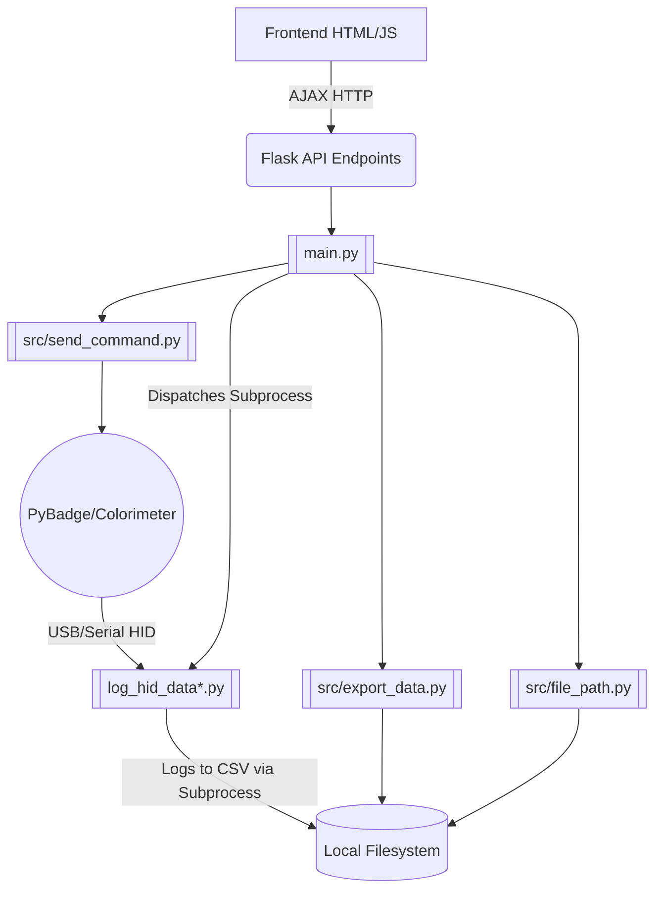

# Codebase Map & Logic (Main Branch)

This file serves as the primary orientation for the Antigravity agent regarding the **Main** branch of the `microalbumin-Flask` repository.

## Project Overview
The `main` branch contains the **Local Desktop/Web Application** (Easy OKAPI).
It is a Flask-based web application meant to run locally on a user's machine (Windows or Mac). It communicates with a physical colorimeter device (powered by a PyBadge with CircuitPython) over USB/Serial connection using HID. 

The application provides a Web GUI (via Flask templates and vanilla JavaScript) for users to:
1. Log raw measurement data directly from the PyBadge into local `.csv` files.
2. Browse local directories to view recorded `.csv` data.
3. Conduct analysis and generate Standard Curves based on measurement modes (`kinetics`, `point`, `calibrate`).
4. Perform local file operations (copy, edit, delete `.csv` and `.json` standard curve files).

## Architecture & Relationships

## Core Application Structure
- [[main.py]]: The main Flask entry point. Hosts endpoints for file operations, starts/stops physical device polling, and serves the index HTML.
- [[log_hid_data.py]] / [[log_hid_data_pyusb.py]]: Scripts used via `subprocess` to continuously poll the PyBadge over USB/Serial and append data to log files.
- `src/`: Contains Python utility functions:
  - [[src/send_command.py|send_command.py]] / [[src/browser_mgt.py|browser_mgt.py]]: Manages the application lifecycle and serial communication commands.
  - [[src/file.py|file.py]] / [[src/file_path.py|file_path.py]] / [[src/export_data.py|export_data.py]]: Local file parsing, reading local directories, and manipulating `.csv`/`.json` arrays.
- `static/script/`: Vanilla JavaScript handling the frontend functionality:
  - [[static/script/hid-logging.js|hid-logging.js]]: Interacts with endpoints to talk with PyBadge.
  - [[static/script/data-handling.js|data-handling.js]] / [[static/script/calculate.js|calculate.js]] / [[static/script/generate-chart.js|generate-chart.js]]: Logic for data processing and HTML canvas plotting.
  - [[static/script/index.js|index.js]] / [[static/script/navigation.js|navigation.js]]: Frontend state and DOM updates.
- `installer-mac/` & `installer-win/`: Scripts, `.bat`, `.command` files to create dmg and exe setups, installing PyEnv, Venv, and launching the application.

## Critical State & Distinctions
- **Local Application Scope**: Since this branch is run locally, it reads and writes heavily to the host OS filesystem (in `json/`, `log/`, and directories of the user's choosing). Security implementations (like path traversal checks) are aimed at avoiding OS command execution beyond the target folders, but it does run local scripts.
- **Hardware Integration**: The key distinguishing feature of this `main` branch is the physical integration with PyBadge, sending serial commands using the `src/send_command.py` and reading by parallel subprocesses.
- **No Global Store Package**: The UI relies on Vanilla JS with state tracking in JS memory, without complex frontend frameworks like React.

*Note: For the publicly shared web application codebase, refer to the `online` branch.*