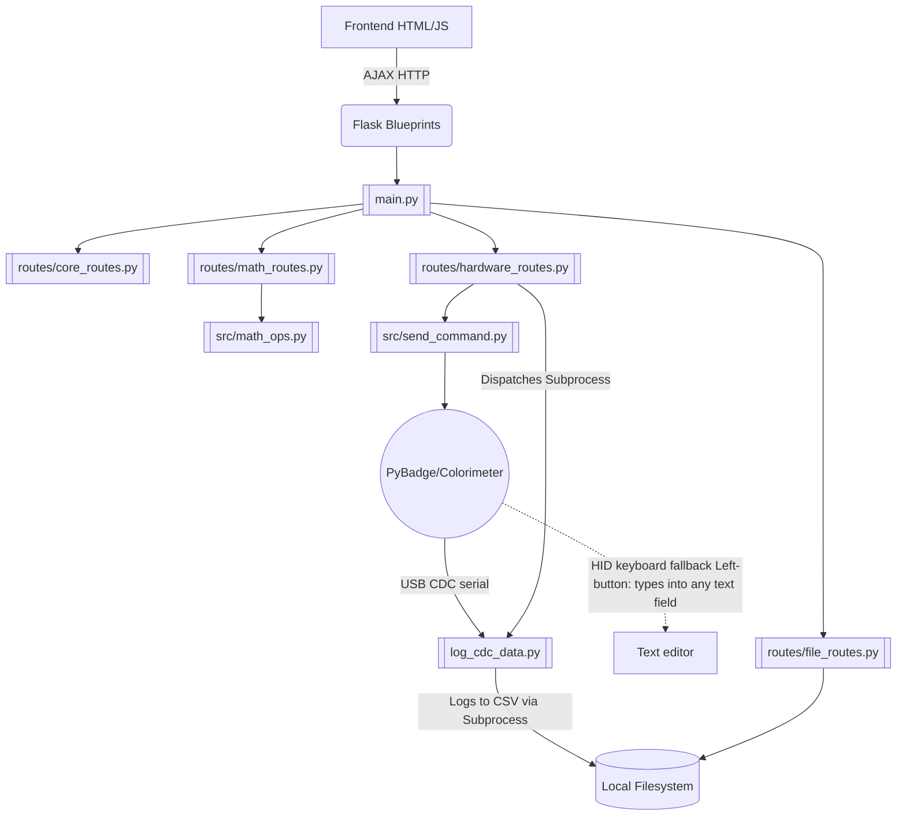

# Codebase Map & Logic (Main Branch)

This file serves as the primary orientation for the Antigravity agent regarding the **Main** branch of the `microalbumin-Flask` repository.

## Project Overview
The `main` branch contains the **Local Desktop/Web Application** (Easy OKAPI) — version **1.2.12**.
It is a Flask-based web application meant to run locally on a user's machine (Windows or Mac). It communicates with a physical colorimeter device (powered by a PyBadge with CircuitPython) over a USB CDC serial connection (with an HID-keyboard fallback the device triggers via its Left button). 

The application provides a Web GUI (via Flask templates and vanilla JavaScript) for users to:
1. Log raw measurement data directly from the PyBadge into local `.csv` files.
2. Browse local directories to view recorded `.csv` data.
3. Conduct analysis and generate Standard Curves based on measurement modes (`kinetics`, `point`, `calibrate`).
4. Perform local file operations (copy, edit, delete `.csv` and `.json` standard curve files).
5. Generate, save, and manage HTML analysis reports organized by subject.

## Architecture & Relationships

## Core Application Structure

- [[main.py]]: Thin Flask entry point (197 lines). Handles CLI args, registers blueprints, browser launch, atexit cleanup, and `app.run()`. All routes are in blueprints.
- [[log_cdc_data.py]]: Spawned via `subprocess` by `/run_script`; owns the CDC serial port for the session (sends start commands, waits ACKs, reads the data stream) and appends data to CSV. The HID-keyboard fallback (device Left button) types into any focused text field and has no host capture script.

### Backend Modules (`src/`)

**New modules (added since v1.0.0):**
- [[src/state.py|state.py]]: Global state singleton — `process`, `monitor_thread`, `args`, paths (`log_file`, `json_root_path`, `report_root_path`), `delimiter`, `PRODUCTION_MODE`.
- [[src/validators.py|validators.py]]: `@validate_json(schema)` decorator — validates and coerces JSON request payloads, injects `validated_data` kwarg into route handlers.
- [[src/math_ops.py|math_ops.py]]: Server-side regression via `scipy.optimize.curve_fit` + `numpy` — `calculate_coef_and_rsquared`, `calculate_kinetics_quantities`, `map_duplicates`, `get_rsquared_threshold`.

**Route Blueprints (`src/routes/`):**
- [[src/routes/core_routes.py|core_routes.py]]: Core endpoints — ping, index, shutdown, browse, JSON cal listing, `/get_report_subjects`.
- [[src/routes/file_routes.py|file_routes.py]]: All CSV/JSON CRUD, export, merge, and report CRUD routes (`/save_report`, `/export_to_report`, `/get_report_items`, `/delete_report_subject`, `/copy_report_subject`, `/rename_report_subject`).
- [[src/routes/hardware_routes.py|hardware_routes.py]]: Data-logger subprocess control (CDC) — `/run_script`, `/check_status`, `/terminate_script`, `/get_logs`.
- [[src/routes/math_routes.py|math_routes.py]]: Server-side math API — `/calculate_coef_and_rsquared`, `/calculate_kinetics_quantities`.

**Utility modules (unchanged):**
- [[src/send_command.py|send_command.py]] / [[src/browser_mgt.py|browser_mgt.py]]: Application lifecycle and serial communication.
- [[src/file.py|file.py]] / [[src/file_path.py|file_path.py]] / [[src/export_data.py|export_data.py]] / [[src/file_operations.py|file_operations.py]]: Local file parsing, directory navigation, CSV/JSON manipulation.
- [[src/export_cal_json.py|export_cal_json.py]], [[src/get_next_filename.py|get_next_filename.py]], [[src/measure.py|measure.py]], [[src/script_monitor.py|script_monitor.py]]: Supporting utilities.

### Frontend (`static/script/` — 12 JS files)

- [[static/script/hid-logging.js|hid-logging.js]]: PyBadge control UI — talks to hardware blueprint endpoints.
- [[static/script/data-handling.js|data-handling.js]] / [[static/script/edit-file.js|edit-file.js]]: File CRUD, column operations via file blueprint.
- [[static/script/calculate.js|calculate.js]] / [[static/script/generate-chart.js|generate-chart.js]]: Regression and Chart.js rendering — `calculate.js` calls `/calculate_coef_and_rsquared` for server-side math.
- [[static/script/data-display.js|data-display.js]]: Chart orchestration, multi-source handling, calibration routines.
- [[static/script/report.js|report.js]]: Report generation (`generateReport`) and subject CRUD UI (create/rename/copy/delete subjects, export to subject, view items).
- [[static/script/user-guide.js|user-guide.js]]: Interactive step-by-step user guide with spotlight overlay.
- [[static/script/index.js|index.js]] / [[static/script/navigation.js|navigation.js]]: Frontend state (`AppState`) and DOM/directory updates.
- [[static/script/init.js|init.js]], [[static/script/short-hands.js|short-hands.js]]: Page init and DOM helpers.

### Report System

Reports are standalone HTML files saved to `report/<subject>/`. The subject is a subdirectory name chosen by the user. CRUD operations are exposed via the file blueprint and consumed by `report.js`.

### Installers

- `installer-mac/` & `installer-win/`: Scripts and assets to build `.dmg` and `.exe` setups (PyEnv, Venv, launch).
- Startup progress: `main.py` writes `pct label\n` to `/tmp/easyokapi_progress.pipe` (Mac) or `%TEMP%\easyokapi_progress.txt` (Windows) for launch-script progress bars.

## Critical State & Distinctions

- **Local Application Scope**: Reads and writes heavily to the host OS filesystem (`json/`, `log/`, `report/`, and user-selected directories). Security checks target path traversal; local scripts are intentionally executed.
- **Hardware Integration**: Key distinguishing feature — a single CDC serial logger subprocess (`log_cdc_data.py`) that owns the port for control + data; `send_command.py` provides the connect/ACK helpers it uses.
- **Blueprint Architecture**: Routes are split across 4 blueprints; `main.py` is purely a startup orchestrator. Never add routes directly to `main.py`.
- **Server-side Math**: Regression computation moved from JS-only to server-side `math_ops.py` (scipy/numpy). JS `calculate.js` still handles rendering.
- **No Global Store Package**: Vanilla JS with `AppState` for state, no React/Vue.
- **`@validate_json`**: All JSON-accepting POST routes must use this decorator from `validators.py`.

*Note: For the publicly shared web application codebase, refer to the `online` branch.*
