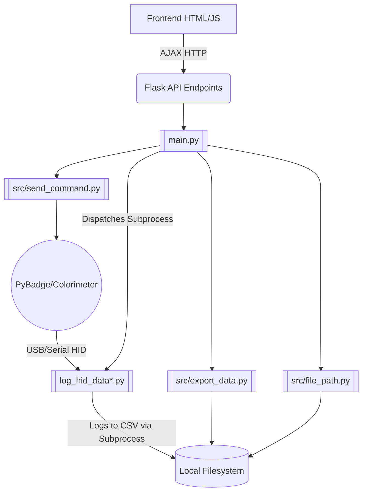

# Codebase & Functional Flow (Main Branch)

This file serves as the primary orientation for any AI agent or developer regarding the **Main** branch of the `microalbumin-Flask` project. **Before writing code, study the relationships and file structures documented here.**

## 1. Project Overview
The `main` branch contains the **Local Desktop/Web Application** (Easy OKAPI).
It is a Flask-based web application meant to run locally on a user's machine (Windows or Mac). It communicates with a physical colorimeter device (powered by a PyBadge with CircuitPython) over USB/Serial connection using HID. 

The application provides a Web GUI (via Flask templates and vanilla JavaScript) for users to:
1. Log raw measurement data directly from the PyBadge into local `.csv` files.
2. Browse local directories to view recorded `.csv` data.
3. Conduct analysis and generate Standard Curves based on measurement modes (`kinetics`, `point`, `calibrate`).
4. Perform local file operations (copy, edit, delete `.csv` and `.json` standard curve files).

## 2. Architecture Overview



### 2.1 Backend (`main.py` — single entry point, ~1132 lines)

| Region | Routes | Consumer |
|---|---|---|
| Region 1 | `/ping`, `/clear_cache`, `/clear_logs`, `/`, `/shutdown`, `/browse`, `/browse_export`, `/get_parents`, `/get_children`, `/get_json_cal` | `index.js` |
| Region 2 | `/get_json_content`, `/get_csv_headers`, `/api/current_output` | `navigation.js` |
| Region 3 | `/run_script`, `/check_status`, `/terminate_script`, `/get_logs` | `hid-logging.js` |
| Region 4 | `/edit_file`, `/delete_file`, `/copy_file`, `/merge_csv`, `/remove_columns`, `/get_num_sources`, `/get_data`, `/get_file_content`, `/export_data`, `/export_cal_coefs` | `data-handling.js`, `edit-file.js`, `data-display.js` |

* **Filesystem-based data storage**: All CSV and JSON files are read/written to the local filesystem using standard Python libraries.
* **Auto-browser launch**: `browser_mgt.py` natively opens the default browser upon server init.
* **Single-user process**: No isolation, no sessions, straight port serving.

### 2.2 Backend Modules (`src/`)

| Module | Purpose |
|---|---|
| `file_path.py` | Filesystem directory browsing: `get_directory`, `browse_directory`, `get_parent_directory`, `get_child_directories` |
| `file.py` | File operations: `get_file_list` (glob), `get_dynamic_data` (parse CSV/JSON from disk), `merge_csv_files`, `replace_empty` |
| `file_operations.py` | `remove_csv_columns` — removes columns from CSV files on disk, renumbers `Value:` columns |
| `measure.py` | `sort_csv_file` — sorts calibration CSV data on disk by concentration |
| `browser_mgt.py` | `open_browser`, `close_port`, `cleanup`, `ensure_host_mapping` — browser/process lifecycle |
| `script_monitor.py` | `check_log_for_errors` — scans `log/script_logs.txt` for PyBadge errors |
| `send_command.py` | `connect_to_device` (find PyBadge via serial), `send_command_and_wait_ack` (serial protocol) |
| `export_data.py` | CSV metadata parsing, header writing, sort by concentration |
| `export_cal_json.py` | Standard curve coefficient processing, JSON export for calibration data |
| `get_next_filename.py` | Auto-naming duplicates (e.g., `file_1.csv`) |
| `mode.py` | Returns available measurement modes: `kinetics`, `point`, `calibrate` |
| `quantity.py` | Returns available quantity options for kinetics analysis |
| `range.py` | Returns display range input configuration |

### 2.3 HID Data Collection (`log_hid_data.py`)
Collects and decodes incoming data from Adafruit PyBadge via `hidapi` over USB connection, spawning into log files configured via parameters.

### 2.4 Frontend (`static/script/` — 11 JS files)

| File | Responsibility |
|---|---|
| `short-hands.js` | DOM utility helpers (`$id`, `$text`, `$hidden`, etc.) |
| `init.js` | Page initialization, event listeners, mode/filter setup |
| `index.js` | `AppState` global state, mode switching, directory updates, `checkServerStatus` |
| `navigation.js` | File table population (CSV and JSON), **directory browsing** (parent/child navigation) |
| `hid-logging.js` | **PyBadge control UI**: `runScript`, `terminateScript`, `checkScriptStatus`, log display |
| `data-handling.js` | File select/deselect/delete/copy/upload/download, data fetching, export logic |
| `data-display.js` | Chart rendering orchestration, multi-source handling, calibration routines |
| `generate-chart.js` | Chart.js chart creation, dataset construction, annotations |
| `calculate.js` | Math: regression (linear, polynomial, logarithmic, exponential, Michaelis-Menten), R² |
| `edit-file.js` | SweetAlert2-based file editor modal (CSV and JSON), column operations |
| `user-guide.js` | Interactive step-by-step user guide with spotlight overlay |

### 2.5 Templates (`templates/`)

| File | Purpose |
|---|---|
| `index.html` | Main SPA template. Jinja2-rendered with server-side data (directory, file list, mode, etc.) |
| `goodbye.html` | Displayed on `/shutdown` — shows farewell screen before process termination |

---

## 3. Installation & Startup

### 3.1 Mac
```bash
# Option A: Installer (.dmg)
# Option B: Scripts
./setup-1-install-pyenv.command   # Install homebrew, pyenv, python
./setup-2-install-venv.command    # Install dependencies to venv/
./setup-3-run.command             # Start the application
```

### 3.2 Windows
Requires `libusbK` driver installed via Zadig for PyBadge HID access.
```cmd
startwindow-1-git.bat
startwindow-2-pyenv.bat
startwindow-3-python.bat
startwindow-4-venv-run.bat
```

### 3.3 Direct Python
```bash
python main.py --port 5099 --alias easyokapi.com
```

---

## 4. Directory Structure (Main Branch)

```
microalbumin-Flask/
├── main.py                     # Flask app entry point (all routes)
├── log_hid_data.py             # HID data collection (Mac, hidapi)
├── log_hid_data_pyusb.py       # HID data collection (Windows, pyusb)
├── requirements.txt            # Python dependencies
├── requirements-win.txt        # Windows-specific dependencies
├── setup-*.command             # Mac utility startup scripts
├── startwindow-*.bat           # Windows utility startup scripts
├── installer-mac/              # Mac .dmg installer assets
├── installer-win/              # Windows .exe installer assets
├── src/                        # Utilities & hardware routing
├── static/                     # Web assets (Raw, unminified source)
│   ├── style.css               
│   └── script/                 # Raw Vanilla JS components
├── templates/
│   ├── index.html              
│   └── goodbye.html            
├── json/                       # Standard curve JSON files
├── log/                        # Script logs directory
└── sample_data/                
```

---

## 5. Key Differences from `online` Branch (Summary)

| Aspect | `main` branch | `online` branch |
|---|---|---|
| Data storage | Local filesystem (`os`, `open`, `Path`) | In-memory `USER_DATA` dict |
| Directory browsing | OS filesystem navigation | N/A (upload-based) |
| HID logging | Enabled (PyBadge USB) | Disabled |
| Users | Single user, no sessions | Multi-user with Flask sessions |
| Google Drive | Not present | Integrated (OAuth 2.0) |
| Static serving | From `static/` (source) | From `static/dist/` (obfuscated) |
| Build step | Not required | Required (`npm run build`) |
| Deployment | Local machine | Heroku |
| Real-time | No SocketIO | Flask-SocketIO with eventlet |
| Flask version | 1.1.4 | Latest (with SocketIO support) |
| Shutdown endpoint | Present (`/shutdown`) | Not applicable |
| `PRODUCTION_MODE` | `True` (controls kill behavior) | `True` (always) |
| Browser auto-launch | Yes (`browser_mgt.py`) | No |
| Installers | `.dmg` / `.exe` / batch scripts | N/A |
