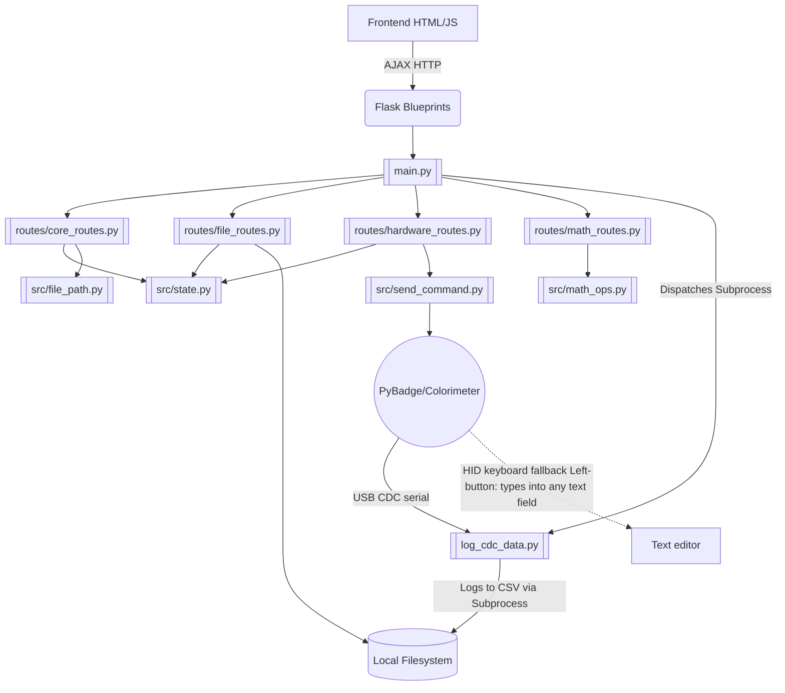

# Codebase & Functional Flow (Main Branch)

This file serves as the primary orientation for any AI agent or developer regarding the **Main** branch of the `microalbumin-Flask` project. **Before writing code, study the relationships and file structures documented here.**

## 1. Project Overview
The `main` branch contains the **Local Desktop/Web Application** (Easy OKAPI) — version **1.4.1**.
It is a Flask-based web application meant to run locally on a user's machine (Windows or Mac). It communicates with a physical colorimeter device (powered by a PyBadge with CircuitPython) over a USB CDC serial connection (with an HID-keyboard fallback the device triggers via its Left button). 

The application provides a Web GUI (via Flask templates and vanilla JavaScript) for users to:
1. Log raw measurement data directly from the PyBadge into local `.csv` files.
2. Browse local directories to view recorded `.csv` data.
3. Conduct analysis and generate Standard Curves based on measurement modes (`kinetics`, `point`, `calibrate`).
4. Perform local file operations (copy, edit, delete `.csv` and `.json` standard curve files).
5. Generate, save, and manage HTML analysis reports organized by subject.

## 2. Architecture Overview



### 2.1 Backend (`main.py` — 197-line thin entry point)

`main.py` handles only: imports, startup progress reporting, CLI argument parsing, blueprint registration, browser launch, atexit cleanup, signal handlers, and `app.run()`.

**All routes live in Flask blueprints under `src/routes/`:**

| Blueprint | File | Routes | Frontend Consumer |
|---|---|---|---|
| `core_bp` | `core_routes.py` | `/ping`, `/clear_cache`, `/clear_logs`, `/`, `/shutdown`, `/browse`, `/browse_export`, `/get_data_folders`, `/get_json_cal`, `/get_report_subjects`, `/settings` (GET+POST), `/data_root` (GET+POST, POST = preview), `/data_root/restart` (POST, commit+relaunch), `/browse_dirs` (GET), `/event_log` (GET+POST), `/list_event_log_files` (GET), `/download_event_logs` (GET all / POST selected, max 5) | `index.js`, `navigation.js`, `report.js`, `init.js`, `event-tracker.js`, `bug-report.js` |
| `file_bp` | `file_routes.py` | `/get_json_content`, `/get_csv_headers`, `/api/current_output`, `/acquire_edit_lock`, `/refresh_edit_lock`, `/release_edit_lock`, `/edit_file`, `/delete_file`, `/copy_file`, `/create_data_folder`, `/create_csv_file`, `/merge_csv`, `/remove_columns`, `/get_num_sources`, `/get_data`, `/get_file_content`, `/export_data`, `/export_cal_coefs`, `/export_cal_excel_formula`, `/get_calibration_json_list`, `/delete_data_folder`, `/rename_data_folder`, `/move_file`, `/save_range_csv`, `/save_normalized_csv`, `/convert_timestamp_to_turn` | `navigation.js`, `data-handling.js`, `edit-file.js`, `data-display.js` |
| `report_bp` | `report_routes.py` | `/save_report`, `/export_to_report`, `/get_report_items`, `/delete_report_subject`, `/copy_report_subject`, `/rename_report_subject`, `/merge_report_subjects`, `/save_report_item_order`, `/delete_report_item`, `/export_report_excel` | `report.js`, `data-handling.js` |

**Cross-tab edit lock** (`file_routes.py` `_edit_locks` registry + `acquire`/`refresh`/`release_edit_lock`): a file opened in the editor of one browser tab is locked from being edited in any other tab. The registry is an in-memory `{abs_path → {token, ts}}` map guarded by a `threading.Lock` (all tabs share one Flask process). `edit-file.js` acquires the lock before loading a file's content (a 423 shows "being edited in another tab"), heartbeats every 30 s to keep it fresh, and releases it when the modal closes or on `beforeunload` (via `navigator.sendBeacon`). A tab that dies without releasing lets the lock go stale after `_EDIT_LOCK_TTL` (120 s). `edit_file` enforces the lock server-side too: a save carries the holder's `edit_token` and is refused (423) if another tab holds the lock. This is separate from the per-write `FileLock` in `edit_file`, which only guards the atomicity of a single save.
| `hardware_bp` | `hardware_routes.py` | `/run_script`, `/measure_point`, `/pause_reading`, `/resume_reading`, `/stream_session` (GET — SSE stream), `/check_status`, `/terminate_script`, `/get_logs`, `/device/state` (GET), `/device/button`, `/device/channels` | `cdc-logging.js`, `live-stream.js`, `device-control.js` |
| `math_bp` | `math_routes.py` | `/calculate_coef_and_rsquared`, `/calculate_kinetics_quantities`, `/calculate_concentration` | `calculate.js`, `data-display.js` |
| `ai_bp` | `ai_routes.py` | `/ai/status`, `/ai/chat`, `/ai/settings` (GET+POST), `/ai/activate`, `/ai/guides`, `/ai/match`, `/ai/feedback` (POST), `/ai/feedback/stats` (GET), `/ai/feedback/reset` (POST), `/ai/feedback/export` (GET) | `ai-chat.js`, `init.js` |
| `update_bp` | `update_routes.py` | `/update/check` (GET), `/update/apply` (POST — SSE stream), `/update/finalize` (POST — shutdown for relaunch) | `init.js` |
| `music_bp` | `music_routes.py` | `/music/stations` (GET — catalogue + online verdict + saved queue/modes), `/music/resolve` (POST — parse+name a pasted YouTube link), `/music/queue` (GET, POST — replace wholesale), `/music/queue/add` (POST — resolve + append) | `music.js`, `init.js` |

* **Filesystem-based data storage**: All CSV and JSON files are read/written to the local filesystem.
* **Auto-browser launch**: `browser_mgt.py` opens the default browser on server init — suppressed by `--no-browser` (set on restart relaunches so a second tab doesn't steal the one-shot reset-display marker).
* **Single-user process**: No isolation, no sessions, straight port serving.
* **Startup progress reporter**: Writes `pct label\n` lines to `/tmp/easyokapi_progress.pipe` (Mac) or `%TEMP%\easyokapi_progress.txt` (Windows) for launch-script progress bars.
* **CLI flags**: `--port` (default 5099), `--alias` (default `easyokapi.com`), `--verbose` / `-v`, `--mem-monitor`, `--no-browser` (skip the startup browser tab; auto-applied by restart relaunches).

### 2.2 Backend Modules (`src/`)

| Module | Purpose |
|---|---|
| `state.py` | **Global state singleton**: `process`, `monitor_thread`, `args`, `script_dir`, `default_data_root` (where the `.dataroot` pointer lives — see `data_root.py`), `log_file`, `json_root_path`, `report_root_path`, `os_name`, `delimiter`, `PRODUCTION_MODE`, `IS_FROZEN`. Also `mark_reset_display_pending()` / `consume_reset_display_pending()` — a one-shot sentinel (`_RESET_DISPLAY_MARKER`, in `default_data_root` so it survives a relocation restart) set before a restart and consumed on the next index render so the app comes up in the default display (kinetics mode, fresh UI state) — see Rule.md §2.20 |
| `i18n.py` | UI localization: `load_catalog(lang)` (English baseline `ui_translations/en.json` overlaid by `<lang>.json`, missing keys fall back to English; cached, best-effort), `normalize_lang(lang)`, `SUPPORTED_UI_LANGUAGES` (from `user_settings.SUPPORTED_LANGUAGES`). Catalogs resolved from `state.bundle_dir`. Drives the `ui_language` user setting + the `index()` `UI_STRINGS` injection — see Rule.md §2.22 |
| `validators.py` | `@validate_json(schema)` decorator — validates and coerces JSON request payloads; injects `validated_data` kwarg into route handlers |
| `security.py` | `init_request_guard(app)` — one `before_request` guard (registered first, in `main.py`) that protects state-changing methods (POST/PUT/PATCH/DELETE) against **CSRF** and **DNS rebinding** on this token-less localhost app. Requires the `Host` the browser addressed to be a known hostname (loopback + the `--alias`, default `easyokapi.com`) and, when present, the `Origin` (else `Referer`) to match — by hostname only, so the port/scheme and the Flask test client's `localhost` all work. See Rule.md §2.24 |
| `math_ops.py` | Server-side regression: `calculate_coef_and_rsquared`, `calculate_kinetics_quantities`, `map_duplicates`, `get_rsquared_threshold`, `evaluate_curve` (evaluate a fitted curve at a single `x` → concentration; powers `/calculate_concentration` and the quick-concentration calculator) — uses `scipy.optimize.curve_fit` and `numpy` |
| `file_path.py` | Data-folder constants and helpers: `DATA_ROOT`, `validate_in_data_root(path)`, `validate_in_allowed_roots(path)` (confines a client-supplied path to the data **or** report **or** calibration-JSON root — `os.path.abspath` resolves `..` first, so both traversal and a bare absolute path outside every root return `None`; used by the file read/edit/delete/copy routes instead of a weak `'..' in normpath` check, which an absolute path like `/etc/passwd` slips through), `validate_in_json_root(path)`, `get_data_subfolders()`, `is_multi_value_timeseries_csv_header()`, `RESERVED_ARCHIVE_FOLDER` (`"root"`) + `is_reserved_data_folder_name(name)` (the `data/root/` archive staging folder is reserved — see Rule.md §2.16). CSV schema utilities: `parse_csv_metadata(lines)` (canonical `# Key: Value` parser), `detect_csv_schema(header_line)` (returns `CSV_SCHEMA_TIMESERIES / TIMESERIES_TURN / KINETICS_CAL / POINT_CAL / POINT_CAL_TURN` — the last is `Concentration,Value`, the turn-based point calibration table with each Turn a standard and no TimePoint, Rule §2.27), `is_multi_value_turn_csv_header()` + `timeseries_x_column(header)` (`'Turn'`/`'Timestamp'`/`None`). A `Turn,Value:1[..]` file is the point-mode variant whose X column is a 1,2,3… turn index (no Timestamp column); `file.get_dynamic_data()` renames the `Turn` key → `Timestamp` on read and returns `x_axis:'turn'` so the `"Timestamp"`-keyed pipeline is untouched (Rule.md §2.27). Concentration-unit: `CONCEN_UNITS` (`ng/µL`, `nM`), `DEFAULT_CONCEN_UNIT` (`ng/µL`), `get_concen_unit(meta)` (default when `# ConcenUnit` absent — see Rule.md §2.10). No mutable state. |
| `file.py` | File operations: `get_file_list` (glob), `build_meta` (stat arbitrary names — files *or* report-subject directories — into a `{mtime, display}` map; `display` rendered via the `time_format` key → `TIME_TAG_FORMATS`), `get_file_meta` (glob files → `build_meta`; powers the Modified-date column on the File Selection + calibration-JSON tables), `sort_file_names` (order names by `name_asc`/`name_desc`/`date_asc`/`date_desc`), `_read_csv_raw` (shared CSV reader: returns meta lines + headers + rows), `get_dynamic_data` (parse CSV/JSON from disk), `merge_csv_files`, `replace_empty`, `ensure_concen_unit_in_dir` (back-fill a `# ConcenUnit: ng/µL` line into recognized legacy CSVs lacking it — idempotent, best-effort; called by `/browse` when a data folder is selected, see Rule.md §2.10), `build_csv_identity` / `build_json_identity` (per-file `{measurement, unit, concen_unit, axis}` identity maps powering the table identity badge + the CSV↔JSON pairing match — `axis` is `turn`/`time`/`None` and blocks pairing a Turn data file with a time-series calibration, Rule §2.27; surfaced as `files_identity` on `/browse` + `/get_json_cal` and `FILE_IDENTITY`/`CAL_JSON_IDENTITY` on the index; `"NONE"`/blank normalized to a wildcard), `ensure_cal_units_in_dir` (back-fill missing `meas_unit`=`"NONE"` / `concen_unit`=`ng/µL` into legacy calibration JSONs on `/get_json_cal` — idempotent, the JSON analogue of `ensure_concen_unit_in_dir`) |
| `file_operations.py` | `remove_csv_columns` — removes columns from CSV files on disk, renumbers `Value:` columns |
| `measure.py` | `sort_csv_file` — sorts calibration CSV data on disk by concentration |
| `browser_mgt.py` | `open_browser`, `close_port`, `cleanup`, `ensure_host_mapping` — browser/process lifecycle |
| `script_monitor.py` | `check_log_for_errors` — scans `log/script_logs.txt` for PyBadge errors |
| `send_command.py` | `connect_to_device` (find the PyBadge CDC **data** port by `PING`-probing every vid/pid candidate — the console port is indistinguishable by USB metadata), `send_command_and_wait_ack` (serial protocol; skips non-ACK noise, drains + stops the device between retries), `LineReader` (buffered line assembly — mandatory at the short `PORT_TIMEOUT`, since `readline()` would return fragments) |
| `ai_assistant.py` | Groq chat (`_groq_chat_stream` token streaming, `chat_stream`), MCP tool engine, multilingual system prompts, `proxy_chat_stream()` for desktop proxy mode, `deterministic_events()` (shared no-LLM greeting/out-of-scope/report-clarify turns applied to both paths) |
| `ai_feedback.py` | Answer 👍/👎: append-only `ai_feedback.jsonl` log + learned per-guide matcher weights (`ai_guide_weights.json`); `record_feedback()`, `learned_bonus()`/`learned_terms()` consumed by `_match_guide_example`; `is_enabled()` (opt-out), `stats()`, `clear()` (reset), `file_paths()` (export). LLM answers logged only |
| `user_settings.py` | Load/save `user_settings.json`; owns `SUPPORTED_LANGUAGES` (the six UI/AI-chat languages, source of truth for `i18n.py` + `routes/ai_routes.py`); user UI preferences: `theme`, `ui_language` (interface language, one of `en`/`vi`/`zh`/`fr`/`ja`/`ru`, default `en`; App Settings → General — drives `i18n.load_catalog` for the page, see Rule.md §2.22), `time_tag_format` (date/time tag format for file modified-date tags: `iso`/`iso_sec`/`us`/`eu`/`date_only`, default `iso`; App Settings → General), `default_mode`, `default_window_size`, `default_subfolder`, `file_sort_order` (default File Selection sort: `name_asc`/`name_desc`/`date_asc`/`date_desc`, default `date_desc`), `default_concentration_unit` (unit selected for new calibration exports: `ng/µL`/`nM`, default `ng/µL`; the legacy back-fill always uses `ng/µL` regardless — see Rule.md §2.10), `event_log_retention_days`, `merge_directory_picker` (opt-in folder-browser step for the merge dialog; the accordion lists the data root itself plus subfolders, with a global Select all / Deselect all toggle and a per-folder "Select all in this folder" checkbox), `disable_popups` (suppress confirmation/alert popups; lives in App Settings → General, mirrored onto the hidden `#no-swal-checkbox`), `y_axis_scale_mode` (chart vertical-axis scale: `auto` fits to data, `custom` pins a fixed range, default `auto`; App Settings → Data Display) + `y_axis_custom_min`/`y_axis_custom_max` (the fixed bounds used when `custom`, defaults `0.0`/`0.6`; `findYDimension` in `data-display.js` honours them verbatim), … |
| `data_root.py` | User-selectable data root (frozen builds, Rule.md §2.19): `get_info()` → `{current, default, is_custom}`, `set_data_root(parent)` → `(path, moved)` (copies the whole root into `<parent>/EasyOKAPI`, writes the pointer, then **moves** = removes the original **unless** it is the default, which is kept as a fallback), `reset_to_default()` → `(path, moved)`, plus dry-run previews `preview_data_root(parent)` / `preview_reset()` → `(target, moved)` that validate **without** touching the filesystem (the move is deferred until the user accepts the restart). The `.easyokapi_dataroot` pointer lives **beside** the default folder (`state._dataroot_pointer_path()`, i.e. in `<Documents>`/`<home>`) so it survives the default folder being deleted; resolution is in `state._read_dataroot_override()` (import-time, so a change needs an app restart). `POST /data_root` previews; `POST /data_root/restart` commits the move then relaunches in place via `update_service.restart_after_delay()` and serves `restarting.html`, which polls `/ping` and reloads the tab once the new instance is up. A data root inside `bundle_dir` (the EasyOKAPI program folder) is rejected. The folder is chosen via the `/browse_dirs` navigator. The Windows installer (`setup-frozen.nsi`) Data Folder page lets the user pick the location at install time, and the uninstaller reads the same pointer. |
| `event_logger.py` | Append/read user interaction events; logs go to `log/events/YYYY-MM-DD/HH-MM-SS.jsonl` (one file per app launch per day); `cleanup_old_logs()` keeps only the `event_log_retention_days` most recent date folders (today = day 1; 0 = keep forever); runs on index render and after `POST /settings` |
| `hwid.py` | Stable per-machine fingerprint `get_hwid()` (SHA-256 of an OS machine id); basis of the hardware lock. Recipe mirrored by the Windows installer PowerShell |
| `activation_pubkey.py` | Embedded RS256 public key (`ACTIVATION_PUBLIC_KEY_PEM`) for verifying permanent tokens offline |
| `activation.py` | Reads/writes `activation.json`; `get_license_token()`, `AI_SERVICE_URL`; `verify_token()` = RS256 signature + `hwid`-claim check; `is_activated()`/`needs_activation()` gate; `get_hwid()`; `_ALLOW_LEGACY_HS256` grandfather toggle |
| `update_service.py` | Auto-update: `check_for_update()` (calls `/api/version`, compares against the running `state.APP_VERSION`). `download_and_apply(progress_cb)` branches on `sys.frozen`: **source build** downloads a `.py` tarball via `/api/download`, overwrites files in place (preserving user data), `_install_requirements()`, then `restart_after_delay()` (Unix: `os.execv`; Windows: detached PowerShell relauncher that waits for the port to free, then relaunches hidden). **Frozen build** (no `.py` on disk) downloads the platform onedir bundle via `/api/download?platform=&kind=bundle`, stages + verifies it in app-data, and `apply_pending_swap_and_exit()` (driven by `/update/finalize`) spawns a detached PowerShell/`sh` helper that waits for the port, swaps the install dir (rollback on failure), and relaunches the new binary — no pip step. Windows PowerShell spawns resolve the absolute interpreter via `_powershell_exe()` (`%SystemRoot%\System32\…\powershell.exe`) so a stripped frozen `PATH` can't fail the spawn, and use `CREATE_NO_WINDOW \| CREATE_NEW_PROCESS_GROUP` (NOT `DETACHED_PROCESS`, which leaves the console-app `powershell.exe` with no console so it exits before running — see Rule.md §2.18); a handoff failure is logged to `log\update_swap.txt` by `update_routes._delayed_shutdown` rather than swallowed. The coordinator is spawned with `cwd=state.script_dir` (NOT the install dir — a running process holding `$live` as its cwd blocks the rename), and the elevated swap script sets `$ErrorActionPreference='Stop'` so a failed move rolls back instead of nesting the new build inside the old one — see Rule.md §2.18 |
| `export_data.py` | CSV metadata parsing, header writing, sort by concentration |
| `export_cal_json.py` | Standard curve coefficient processing, JSON export for calibration data. The exported JSON also records its **identity** — `for_meas` (Measurement), `meas_unit`, `concen_unit` — so a measurement CSV can be matched against it before deriving concentration (see Rule.md §2.10) |
| `excel_formula.py` | Build Excel formula strings from fitted standard-curve coefficients: `excel_formula(regress_algo, coef_dict, cell)` (one of the 5 models → a `quantity → concentration` formula, coefficients parenthesised so negatives stay valid) + `formulas_from_content(content, algo, cell)` (walk a `processJSONCoef` result into labelled per-source formulas). Consumed by `/export_cal_excel_formula` |
| `get_next_filename.py` | Auto-naming duplicates (e.g., `file_1.csv`) |
| `mode.py` | Returns available measurement modes: `kinetics`, `point`, `calibrate` |
| `quantity.py` | Returns available quantity options for kinetics analysis |
| `range.py` | Returns display range input configuration |
| `routes/__init__.py` | Empty package marker |

### 2.3 Data Collection (`log_cdc_data.py` — the only host logger)
**CDC / USB serial:** `log_cdc_data.py` is spawned by `/run_script` and owns the single serial port for the whole session — it connects, sends `1`/`TIMEOUT:x`/`AXIS:time|turn`/`INTERVAL:x`, waits for ACKs (`AXIS` picks the first-column axis — `--axis`, default from the `cdc_axis` setting), then reads clean UTF-8 data lines on the same connection and writes the CSV (+ `log/current_output.txt`). No `sudo`/admin, no keycode decoding, no `hidapi`/`pyusb`/`libusbK`, cross-platform. On SIGINT/SIGTERM it sends `0` so the device leaves talking mode.

**Start-up notice:** `/run_script` returns as soon as the logger process survives 0.5 s — the device has not been reached yet. Port probing, the 3×5 s command handshake and the firmware settle all happen after that, silently, so `#reading-startup` shows a phase notice (*Looking for the colorimeter… → Device found. Starting the session… → Waiting for the first reading…*) with a live elapsed counter, driven off the logger's own log lines via `fetchLogs()`. If the run has not gone live within `reading_start_timeout_sec` (user setting, default 60 s, clamped 10–600) the client reports a timeout and stops the run. See **Rule.md §2.30**.

**Port selection + read cadence:** the board can expose **two** identical-looking CDC ports (console + data), so `connect_to_device()` probes each with `PING` and keeps whichever answers `ACK_PING`/`ERR_UNKNOWN`. The port timeout is 0.15 s so the manual-measure trigger is picked up promptly, and all reading goes through `LineReader` so the short timeout never yields a partial line. See **Rule.md §2.28**.

**Live session streaming (SSE):** while a run is in progress the browser holds `GET /stream_session` open and the server pushes what changed. `src/live_stream.py` tails the log (`state.log_file`) and the active CSV (path from `log/current_output.txt`) by byte offset, emitting `meta` (file identity + metadata/`num_sources`/`x_axis`, once per CSV when the header lands), `rows` (newly appended rows, normalised exactly as `file.get_dynamic_data` normalises them), `log` (appended log text) and `end`. `static/script/live-stream.js` accumulates rows and re-renders through the same `processResponse()` a full fetch uses, and calls `onNewDataPoint()` once per row — so manual point mode's **Measure now** re-arms when its row lands rather than up to 2 s later. This replaces the old 500 ms `/get_data` chart poll and 2 s `/get_logs` poll, which both still exist as the fallback: `index.js` runs them only while `liveStreamCarrying()` is false (no `EventSource`, stream not open, reconnect gap, or `live_stream_enabled: false`). `/check_status` keeps sole ownership of the run-end transition. See Rule §2.31.

**Manual (on-demand) point-mode capture:** with `--manual` (from `/run_script` `manual:true`, only offered in point mode with **Record as Turns** on; forces the turn axis) the start chunk inserts `MANUAL:1` (ACK `ACK_MANUAL`) between `AXIS:` and `INTERVAL:`, and the device idles instead of streaming — it emits one row per `MEASURE` command. Since the logger owns the port, `POST /measure_point` drops a `log/measure_trigger.txt` file that the logger's read loop consumes and forwards as `MEASURE`. No interval/timeout; the session ends on Stop. Scrolled away from the control panel, the manual run gets the same floating transport bar as an automatic one (`#measure-point-fab`: `READY`/`MEASURING` readout + Measure now + Stop) — see Rule §2.29. Firmware `serial_manager.py` is in lockstep (`session_manual`, `_emit_row`/`_emit_manual_row`). See Rule §2.27.

**Pause / Resume a live run:** an automatic capture can be held without ending it — `POST /pause_reading` / `POST /resume_reading` drop `log/control_trigger.txt` holding the desired state (`PAUSE`/`RESUME`), which the logger's read loop forwards to the device (ACK `ACK_PAUSE`/`ACK_RESUME`). The device stops measuring and freezes its session clock, so timestamps stay continuous and the pause does not consume the timeout; the logger also drops any row that still arrives, which keeps the pause working against firmware predating the command (at the cost of a gap in Timestamp). Two UI entry points share the state: the inline **Pause reading** button on the reading-panel button line and the floating `#reading-control-fab` — a session transport bar (breathing dot + `RECORDING`/`PAUSED` readout, divider, Pause/Resume + Stop) shown when that line scrolls out of view. Manual point-mode runs get **Measure now** instead — there is nothing to pause. See **Rule.md §2.29**.

**Virtual controller (the device's keypad, on screen):** `src/device_link.py` opens the CDC port itself — but **only while no reading session is running**, so the port still has exactly one owner (§2.28/§2.29). `GET /device/state` sends `STATE?` and parses the firmware's one-line `key=value;` snapshot (mode, measurement, units, live values, blank state, session state, per-sensor gain/integration time, menu position, concentration, timing settings, battery, and a `caps` list); `POST /device/button` sends `BTN:<name>` (ACK `ACK_BTN`); `POST /device/channels` sends `CHANNELS:0,3` (ACK `ACK_CHANNELS`, refusal carries the reason). All three answer **409** while `state.process` is alive, and `/run_script` calls `device_link.link.close()` before spawning the logger. The link holds the port between commands (opening costs the settle + PING probe) with a daemon reaper that drops it after 30 s idle, and retries once on a fresh connection when a replugged device stops answering. `static/script/device-control.js` renders a collapsed-by-default panel — a readout plus the PyBadge's two button clusters, each button labelled with **what it does on the device's current screen** — and polls only while expanded. Where builds differ the firmware says so in `caps`: `channels` (selectable multiplexer channels, open-extra only), `selsensor` (Right picks the sensor gain/itime act on), `uvchannel` (Right steps the sensor's spectral channel). Channel changes are runtime-only — CircuitPython cannot write its own filesystem, so a power cycle restores `configuration.json`. Firmware `serial_manager.py` + `button_handler.press()` are in lockstep on all four branches. Settings: `device_control_enabled` (default on), `device_state_poll_ms` (default 1500). See **Rule.md §2.35**.

**Background music (online-only):** `GET /music/stations` (`src/routes/music_routes.py`) returns the curated station catalogue from `src/music.py` plus an `online` verdict from a cached TCP probe (`is_online()`, 30 s cache, two hosts tried). `static/script/music.js` mounts a bottom-left 🎧 widget — station picker, play/stop, volume — whose `<audio>` element connects **straight to the broadcaster**; no audio passes through Flask. Stations are free, listener-supported, https streams (SomaFM, Radio Paradise). The widget mounts only when `music_enabled` is on *and* the browser and the probe both say online, unmounts on the `offline` event, and gives up on a station that has not produced audio within 12 s. Gated by `music_enabled` (default **off**, App Settings → Background Music); `music_station` / `music_volume` are remembered and saved through `/settings` debounced. A second source plays the user's own **YouTube** queue: links are pasted, not searched (search would need a Data API key whose 10,000-unit daily quota one shipped key could not survive), parsed and named server-side by `music.parse_youtube_ref()` + the keyless oEmbed endpoint, queued in `music_queue.json` (`src/music_queue.py` — server-side because a restart clears per-view `localStorage`, §2.20), and played by YouTube's IFrame player in a **visible** 200 px video pane as its terms require. Nothing extracts or caches the media. Repeat (`off`/`one`/`all`) and shuffle are applied by the widget over the queue. Spotify is deliberately absent: third-party playback there requires Premium plus OAuth, so it cannot be free. See **Rule.md §2.32** and §2.32.1.

**Zero-software fallback (HID keyboard):** triggered by the device's **Left button** only — the firmware "types" the CSV via keyboard emulation into whatever text field has focus (e.g. a text editor). There is no host-side HID capture script. The app's automated flow does not use HID.

Firmware transport switch: `open_colorimeter_firmware/src/serial_manager.py` — host-initiated sessions use `transport="cdc"` (`usb_cdc.data`), button-initiated use `transport="hid"`.

**Session-end sentinels (device → host):** a CDC session ends with one of two text lines the firmware streams and `log_cdc_data.py` parses (`_finish_session` logs them verbatim):
- `SESSION TIMEOUT` — the configured timeout elapsed.
- `SESSION STOPPED` — the user pressed the device's **Left button** mid-session (firmware emits it for `transport == "cdc" and not start_by_host`; the host's own `0`-command stop does not). Present on all firmware branches (`main`, `open-plus`, `open-uv`).

`script_monitor.check_log_for_end_reason()` maps the log to `'timeout'`/`'stopped'`, which `check_status` turns into a reason-aware completion message; `cdc-logging.js` (`fetchLogs` + `resetUIAfterCompletion`) shows "Session ended due to timeout." vs "Session stopped manually on the device.".

### 2.3.9 Visual design system (`static/style.css` + `static/fonts/`)

`style.css` opens with a **token block** that is the single source of colour, type, radius and elevation: `:root` carries the light-mode values and `body.dark` re-steps them for graphite (dark is designed, not inverted). Semantic tokens are `--bg / --panel / --well / --hairline / --hairline-soft / --ink / --ink-muted / --ink-dim`, `--accent / --accent-strong / --accent-wash`, the reserved status trio `--danger / --warn / --go`, the sequential `--ramp-1..10 / --ramp-blank`, the two radii `--r-flat` (0, data surfaces + fields) and `--r-press` (4px, pressables), and the three type roles `--font-ui / --font-mono / --font-label`. Legacy names (`--primary-gradient`, `--surface-light`, `--border-radius`, `--shadow-*`) are kept as aliases resolving to the tokens, so the whole 5000-line sheet inherits the palette; the "gradients" are flat fills.

The palette is derived from the **assay**, not from light: `--accent` is bromophenol blue, and the device has no selectable wavelength to colour-code (see Rule §2.33). Chrome (`.section`, fields, buttons) is flat and hairline-bounded; only plots, readouts, tables and genuinely floating layers get elevation.

**Type** is IBM Plex, self-hosted: `static/fonts/plex.css` declares one `@font-face` per weight per subset (latin / latin-ext / vietnamese / cyrillic / greek, original `unicode-range` preserved) against the `.woff2` files beside it, and `style.css` imports it. Nothing is fetched from Google Fonts — the app vendors every dependency and must render the same offline (Rule §2.4). Mono with tabular figures is used for every measured value, field and axis tick; condensed uppercase is the panel-label voice (a `.section` heading).

**Source colours** come from `sourceRamp(n)` in `index.js`, which spreads *n* series across `--ramp-1..10`; `AppState.plotColors` is a getter over it so a theme switch repaints. Multi-source data is ordered (standards on consecutive mux channels), so it gets a sequential ramp rather than a cycled categorical palette.

**Interface style switch** — `ui_style` (`instrument` default / `classic`) selects the visual language. `classic` is the previous look, restored by a `body.ui-classic` override layer at the end of `style.css` — a **generated** declaration-level diff of v1.3.11's stylesheet (`tools/gen_classic_style.py`, between the BEGIN/END GENERATED CLASSIC LAYER markers), plus a hand-written token block and a reset block for the rules the redesign added (Tailwind greys + indigo/purple gradients, blurred cards with a hover lift, 12px radius, Inter/Outfit from `static/fonts/classic.css`, headline panel headings, the 16-colour categorical palette, the pill theme toggle, the orb splash). The Windows splash launchers (`installer-win/launcher-frozen.ps1`, `installer-win/launcher.ps1`) follow the same setting — each carries a classic and an instrument XAML template and picks one by reading `user_settings.json` from the resolved data root, falling back to instrument on any error. The class is stamped on `<body>` by the index render, so there is no flash; `isClassicUI()` in `index.js` reads that class and gates the two JS-side differences — `sourceRamp()` returns `CLASSIC_PLOT_COLORS`, and `stripEnabled()` returns false so the session strip stays down and the top-right timer widget is the live readout again. Correctness fixes (unitless-axis label, chart heading, marker density, self-hosted fonts) are shared by both styles. See **Rule.md §2.34**.

**Session strip** — `#session-strip` in `index.html`, drawn by `drawSessionStrip()` in `cdc-logging.js`: a fixed 64px chart-recorder trace of the run in progress (one polyline per source, same ramp), plus a `Recording`/`Paused` state readout, the session clock, the countdown to the next reading, and either the latest value (single source) or the row count. It reads `AppState.responseData`, so it issues no requests of its own; it is revealed on the first landed row and torn down with the session timer, and greys/freezes when the run is paused. It **replaces** the top-right `#session-timer` widget, which `onNewDataPoint` now mounts only when the strip is off — `tickSessionTimer()` computes the clocks once and writes both readouts, so there is still one clock. The countdown field hides itself when there is no interval (manual point mode). Setting: `session_strip_enabled` (default on).

### 2.4 Frontend (`static/script/` — 16 JS files)

| File | Responsibility |
|---|---|
| `event-tracker.js` | `logEvent(type, action, details)` — fire-and-forget POST to `/event_log`; loaded before all other scripts |
| `tooltip.js` | Styled hover-hint component. Any `[data-hint="…"]` element shows a single `#okapi-tooltip` bubble appended to `<body>` (so it escapes `overflow:hidden` collapsibles), positioned above/below the target on hover or keyboard focus. Replaces native `title=` tooltips; styling lives in `style.css` (`#okapi-tooltip`, light/dark themed) |
| `short-hands.js` | DOM utility helpers (`$id`, `$text`, `$hidden`, etc.) |
| `i18n.js` | UI translation applier (loaded after `short-hands.js`, before all app scripts). Reads the injected `UI_STRINGS`/`UI_LANG`; `applyTranslations()` translates `[data-i18n]`/`-html`/`-hint`/`-ph`/`-aria` elements on load; `window.t(key, fallback)` for dynamic strings (Swal dialogs, JS-built tables). English text in the HTML is the fallback. See Rule.md §2.22 |
| `init.js` | Page initialization, event listeners, mode/filter setup |
| `index.js` | `AppState` global state, mode switching, directory updates, `checkServerStatus`, and the **source ramp** (`sourceRamp(n)` / `rampStops()` reading `--ramp-*`; `AppState.plotColors` is a getter over it) |
| `navigation.js` | File table population (CSV and JSON), **data subfolder picker** (`loadDataFolders`, `selectDataFolder`, `filterDataFolderList`, `updateFolderListSelection`, `renameDataFolder`, `deleteDataFolder`), **identity-aware file search** (`filterTable` + `parseSearchQuery` / `_identityFieldMatch`: space-separated positional filters `name meas unit concen`, all AND-ed, matched against `AppState.fileIdentity`/`jsonIdentity` — see Rule.md §2.10) |
| `hid-logging.js` | **PyBadge control UI**: `runScript`, `terminateScript`, `checkScriptStatus`, log display |
| `data-handling.js` | File select/deselect/delete/copy/move, data fetching, export logic |
| `data-display.js` | Chart rendering orchestration, multi-source handling, calibration routines |
| `generate-chart.js` | Chart.js chart creation, dataset construction, annotations. Chart chrome follows the design tokens: mono tick figures, condensed axis/chart titles, `Measurement — filename` heading, measurement-name fallback for a unitless y-axis (`isNoneUnit`), markers dropped past 40 points |
| `calculate.js` | Math: regression (linear, polynomial, logarithmic, exponential, Michaelis-Menten), R²; calls `/calculate_coef_and_rsquared` for server-side computation |
| `edit-file.js` | SweetAlert2-based file editor modal (CSV and JSON), column operations |
| `report.js` | Report generation (`generateReport`), subject CRUD UI (create/rename/copy/delete subjects, export to subject, view items) |
| `user-guide.js` | Interactive step-by-step user guide with spotlight overlay; supports *dialog steps* (`.swal2-*` targets) that lift above SweetAlert2 and auto-advance on dialog close (see Rule.md) |
| `ai-chat.js` | Floating AI chat widget: panel toggle, multilingual language selector, settings panel, model download progress, conversation history, edit-and-resend on user messages, new-conversation button, 👍/👎 answer feedback |
| `music.js` | Floating background-music widget (bottom-left 🎧). Two sources: **Radio** (free listener-supported stations, `<audio>` straight to the broadcaster) and **YouTube** (queue of pasted links played by the IFrame player, visible video pane). Play/stop, prev/next, volume, repeat off/one/all, shuffle, queue add/remove/clear, online-only mount/unmount. Flask serves metadata only — no audio passes through the app |
| `bug-report.js` | "Report a Bug" button (left column, below Options): SweetAlert flow — (1) attach logs? (2) pick up to 5 `log/events/` files (`/list_event_log_files`), (3) name the zip. `POST /download_event_logs` bundles the chosen files and downloads the zip to the machine, then a `mailto:` draft to `state.MAINTAINER_EMAIL` opens with an instruction to attach that downloaded zip manually (mailto: cannot pre-attach files). "No, just email" opens a plain `mailto:` with no attachment. |

### 2.5 Templates (`templates/`)

| File | Purpose |
|---|---|
| `index.html` | Main SPA template. Jinja2-rendered with server-side data: `data_root`, `report_root`, `json_root` path constants (instead of `directory`), plus file list, mode, quantity, delimiter, etc. Also `ui_lang` → `<html lang>` + `const UI_LANG`, and `ui_strings` → `const UI_STRINGS` (the active i18n catalog) consumed by `i18n.js`; in-scope elements carry `data-i18n*` attributes with English text as the fallback (Rule.md §2.22). Also `reset_display` → `const RESET_DISPLAY`: when true (first load after a restart) it drops per-view `localStorage` UI state (keeping `theme`/`okapi_ai_lang`/`okapi_ai_first_run`) before `init.js` runs, which then forces kinetics mode — the default display — see Rule.md §2.20. |
| `goodbye.html` | Displayed on `/shutdown` — the shutdown screen shown while the process terminates (5 s countdown, then closes the tab). Rendered in **both interface styles** (Rule.md §2.34): `/shutdown` passes `ui_style` from `user_settings`, and the template branches server-side — `classic` keeps the orb/glass card with the checkmark and countdown ring, anything else (i.e. `instrument`) draws the flat hairline-bounded panel with the parked chart-recorder trace and a draining hairline countdown bar. Tokens are copied from `static/style.css` rather than linked (the page must not inherit app layout) — keep them in step. Type is self-hosted for both styles (`fonts/plex.css` / `fonts/classic.css`, no Google Fonts request). One shared countdown script drives whichever of `#ring-fill` / `#countdown-fill` the render produced. |

---

## 3. Report System

Reports are generated as standalone HTML files and organized under `report/<subject>/`.

| Route | Method | Purpose |
|---|---|---|
| `/get_report_subjects` | GET | List subject subdirectories in `report/` (also returns `subjects_meta` = `{name: {mtime, display}}` for the Modified-date column) |
| `/save_report` | POST | Save HTML report to `report/<filename>/` |
| `/export_to_report` | POST | Copy a report HTML file into a named subject folder |
| `/get_report_items` | GET | List HTML files within a subject folder |
| `/delete_report_subject` | POST | Delete a subject folder and all its reports |
| `/copy_report_subject` | POST | Duplicate a subject folder |
| `/rename_report_subject` | POST | Rename a subject folder |
| `/export_report_excel` | POST | Build an `.xlsx` report (openpyxl). Items carry `csv_columns`/`csv_rows`, `coef_tables`, `analysis_rows`, `derived_lines`, plus charts. **Calibration fit charts ship as `chart_series` (raw `points` + `fit` arrays + `xLabel`/`yLabel`/`title`/`algo`) and render as native, editable Excel `ScatterChart`s** — points as markers, fit as a smooth line, with renameable axis titles. The X/Y axis labels are pre-filled and overridable in the export dialogs (`generateReport` SwAL boxes + the report-console `#console-xlabel`/`#console-ylabel` fields). Legacy `chart_images` (base64 PNG) is still embedded as a fallback when no `chart_series` is present, and is still used for non-calibration time-series snapshots. Helper data for each native chart is written to off-to-the-right columns (col AA onward, a per-sheet `_chart_helper_col` cursor) — kept visible because Excel does not plot hidden cells. |

---

## 4. Math API

Regression is computed **server-side** via `math_ops.py` (scipy + numpy), exposed as REST endpoints. The JS client calls these for calibration and kinetics analysis.

| Route | Method | Payload | Returns |
|---|---|---|---|
| `/calculate_coef_and_rsquared` | POST | `{x, y, regress_algo}` | `{slope, rSquared, coefficients}` |
| `/calculate_kinetics_quantities` | POST | `{XColumn, YColumn, window_size}` | kinetics analysis object |
| `/calculate_concentration` | POST | `{regress_algo, coefficients, x}` | `{concentration}` |

Supported algorithms: `linear`, `polynomial`, `logarithmic`, `exponential`, `Michaelis-Menten`.

**Quick concentration calculator** — `POST /calculate_concentration` (`{regress_algo, coefficients, x}`) evaluates the fitted curve at a single measured quantity `x` and returns the derived concentration, **no CSV data file required**. `coefficients` is a dict (`a`/`b`/`c` or `VMax`/`Km`) or ordered list; the math is `math_ops.evaluate_curve` (same 5 models as the fit). A domain error (log of ≤0, Michaelis-Menten zero denominator) or a missing/non-numeric coefficient returns `400`. Frontend: `quickConcentrationCalc()` in `calculate.js` (**🧮 Quick concentration** button in the Options section) opens a self-contained dialog — pick the model, type the coefficients + measured value, get the concentration inline.

**Excel formula export** — `POST /export_cal_excel_formula` (`{regress_algo, coef_content, cal_params, threshold_val?, cell?}`) turns the fitted standard-curve coefficients into ready-to-paste Excel formulas (the sibling of `/export_cal_coefs`, which writes the JSON). It reuses the same `extractAnalysisCoefficients → processJSONCoef` pipeline, then `excel_formula.formulas_from_content` builds one `quantity → concentration` formula per source (labelled). Returns `{status, cell, algo, formulas:[{label, formula}]}`; a below-threshold / failed fit yields a `null` formula. Frontend: `exportExcelFormula()` in `data-handling.js` (**📐 Excel formula** button beside Export Calibrated Coefs) shows the formulas in a copyable dialog.

---

## 5. AI Assistant

### 5.1 Overview
A floating chat widget (bottom-right corner) powered by **Groq** (cloud LLM API). No local model download is required. The `GROQ_API_KEY` lives only on the online server (Heroku config var); desktop instances authenticate via a locally stored activation token rather than holding the key directly. AI-assistant preferences (`ui_language`, `ai_feedback_enabled`) are persisted in `user_settings.json` via `user_settings.py`; there is no separate `ai_settings.json`.

### 5.2 Supported Languages
English (en), Vietnamese (vi), Chinese Simplified (zh), French (fr), Japanese (ja), Russian (ru).

### 5.3 Default Model
`llama-3.1-8b-instant` (Groq). Override with `AI_MODEL` environment variable.

### 5.4 MCP Tools (available to the LLM — main branch only)
| Tool | Description |
|---|---|
| `get_app_context` | Current directory, CSV/JSON file lists, data-logger subprocess status |
| `read_csv_file` | Read a CSV file (metadata + first N rows) |
| `read_calibration_file` | Read a JSON calibration file from `json/<mode>/` |
| `get_hardware_status` | PyBadge subprocess running/stopped |
| `get_help_topic` | Built-in docs for a feature topic |
| `trigger_guide` | Launch a full preset workflow guide |
| `trigger_custom_steps` | Launch a focused spotlight guide for specific UI elements |

### 5.5 Routes (main branch)
| Route | Method | Purpose |
|---|---|---|
| `/ai/status` | GET | API readiness, activation state, settings |
| `/ai/chat` | POST | Send messages → SSE stream (proxied or dev-direct) |
| `/ai/activate` | POST | Exchange Easy OKAPI download token for local activation token |
| `/ai/settings` | GET | Return current settings |
| `/ai/settings` | POST | Update settings (language, enabled) |
| `/ai/guides` | GET | Return guide examples for a given language |

### 5.6 Settings / language
There is **no** `ai_settings.json`. The AI chat language is client-side: `AI.activeLang` in `ai-chat.js`, chosen from the header language menu and stored in `localStorage` (`okapi_ai_lang`); every chat/match request sends that single active language. It is independent of the interface language (`ui_language` in `user_settings.json`). The list of selectable languages is `user_settings.SUPPORTED_LANGUAGES`. AI-related persisted preferences (`ai_feedback_enabled`) live in `user_settings.json`.

### 5.7 Activation file (`activation.json`)
```json
{
  "license_token": "<permanent JWT>"
}
```
Written to the project root during installation or via the in-app activation form. Read by `src/activation.py`. If absent and no `GROQ_API_KEY` is set in `.env`, the AI widget shows "Not activated" and requests a token.

### 5.8 Setup flow for new users
**Option A — During installation (recommended):**
- Mac: `setup-2-install-venv.command` / `installer-mac/install-venv.command` prompt for language preferences, then ask for the Easy OKAPI download token and call `POST /api/activate` on the server. `activation.json` is written automatically.
- Windows: `startwindow-4-venv-run.bat` does the same via `curl` + Python JSON parsing.

**Option B — After installation, from inside the app:**
1. Click the **🤖 AI Assistant** button (bottom-right of the page).
2. If "Not activated" is shown, paste the Easy OKAPI download token from `easyokapi.cbbiotec.vn` into the activation input and click **Activate**.
3. The app calls `POST /ai/activate`, which exchanges the token with the server and writes `activation.json` locally.

**Developer mode (no activation required):**
Set `GROQ_API_KEY` in `.env`. The app detects this and calls Groq directly, bypassing the proxy. Never ship `.env` with a real key.

---

## 6. Installation & Startup

### 5.1 Mac
```bash
# Option A: Installer (.dmg)
# Option B: Scripts
./setup-1-install-pyenv.command   # Install homebrew, pyenv, python
./setup-2-install-venv.command    # Install dependencies to venv/
./setup-3-run.command             # Start the application
```

### 5.2 Windows
Uses the PyBadge CDC serial port (no `libusbK`/Zadig driver needed).
```cmd
startwindow-1-git.bat
startwindow-2-pyenv.bat
startwindow-3-python.bat
startwindow-4-venv-run.bat
```

### 5.3 Direct Python
```bash
python main.py --port 5099 --alias easyokapi.com
python main.py --verbose          # show HTTP logs + backend prints
python main.py --mem-monitor      # enable tracemalloc memory growth tracking
```

---

## 6. Directory Structure (Main Branch)

```
microalbumin-Flask/
├── CLAUDE.md                   # Claude Code entry point
├── Rule.md                     # AI coding rules
├── main.py                     # Flask app entry point (197 lines, blueprint registration only)
├── log_cdc_data.py             # CDC (USB serial) data collection — the only host logger
├── requirements.txt            # Python runtime dependencies (all platforms)
├── requirements-dev.txt        # Test-only dependencies (pytest)
├── setup-*.command             # Mac utility startup scripts
├── startwindow-*.bat           # Windows utility startup scripts
├── installer-mac/              # Mac .dmg installer assets
├── installer-win/              # Windows .exe installer assets
├── src/
│   ├── state.py                # Global state singleton
│   ├── i18n.py                 # UI translation catalog loader (ui_translations/)
│   ├── data_root.py            # User-selectable data root (.dataroot pointer)
│   ├── validators.py           # @validate_json decorator
│   ├── live_stream.py          # SSE tail of a live session (log + active CSV, by byte offset)
│   ├── device_link.py          # Idle-time CDC control link (virtual controller: STATE?/BTN:/CHANNELS:)
│   ├── music.py                # Radio catalogue + connectivity probe + YouTube link parsing/oEmbed
│   ├── music_queue.py          # Persisted YouTube play queue (music_queue.json)
│   ├── math_ops.py             # Server-side regression (scipy/numpy)
│   ├── routes/
│   │   ├── __init__.py
│   │   ├── core_routes.py      # Core + browse + report subjects
│   │   ├── file_routes.py      # CSV/JSON CRUD + report CRUD
│   │   ├── hardware_routes.py  # Data-logger subprocess control (CDC default)
│   │   ├── math_routes.py      # Regression math API
│   │   └── music_routes.py     # Background music: catalogue, link resolve, queue (metadata only)
│   ├── browser_mgt.py
│   ├── excel_formula.py
│   ├── export_cal_json.py
│   ├── export_data.py
│   ├── file.py
│   ├── file_operations.py
│   ├── file_path.py
│   ├── get_next_filename.py
│   ├── measure.py
│   ├── mode.py
│   ├── quantity.py
│   ├── range.py
│   ├── script_monitor.py
│   └── send_command.py
├── static/
│   ├── style.css                # design tokens + all UI styling
│   ├── fonts/                   # self-hosted type: plex.css (instrument) + classic.css (classic)
│   └── script/
│       ├── calculate.js
│       ├── data-display.js
│       ├── data-handling.js
│       ├── edit-file.js
│       ├── generate-chart.js
│       ├── hid-logging.js
│       ├── live-stream.js      # SSE live-session client (rows + log pushed; polls are the fallback)
│       ├── device-control.js   # Virtual controller panel (device keypad + per-screen button labels)
│       ├── index.js
│       ├── init.js
│       ├── navigation.js
│       ├── report.js           # Report generation + subject CRUD
│       ├── short-hands.js
│       ├── tooltip.js          # Styled [data-hint] hover tooltips
│       ├── i18n.js             # UI translation applier (t() + applyTranslations)
│       ├── user-guide.js       # Interactive user guide
│       ├── ai-chat.js          # Floating AI chat widget
│       └── music.js            # Floating music widget: radio + YouTube queue (online-only)
├── templates/
│   ├── index.html
│   └── goodbye.html
├── data/                       # All user CSV data (auto-created); browsing restricted to here
│   ├── <subfolder>/            # User-named subfolders (created on data run or manually)
│   └── root/                   # RESERVED: installer archive staging for loose data-root files (Rule.md §2.16); users cannot create this name
├── json/                       # Standard curve JSON files
├── log/                        # Script logs directory
├── report/                     # Saved HTML reports (by subject subdirectory)
├── ui_translations/            # UI translation catalogs: en.json (baseline) + vi/zh/fr/ja/ru
├── user_settings.json          # User UI + AI preferences (auto-created, gitignored)
└── sample_data/
```

---

## 6. RAG User Guide Subsystem

A local Retrieval-Augmented Generation pipeline is planned to replace the current keyword-based few-shot injection for the AI-driven user guide. Full architecture, data-flow diagrams, component map, and phased implementation plan are in:

**`easyokapi-knowledge/RAG-USER-GUIDE.md`**

Current state: keyword scan in `_match_guide_example()` (`src/ai_assistant.py:25`) reading `guide_training.json`. Planned replacement: semantic vector search via ChromaDB with a cloud-compatible embedding model, implemented in `src/rag_guide.py` (not yet created).

---

## 7. AI Proxy Architecture

The `GROQ_API_KEY` never ships inside the desktop app package. It lives only as a Heroku config var on the online server. Desktop instances access Groq through a two-phase token mechanism.

### 7.1 Token Lifecycle

```
User logs in at easyokapi.cbbiotec.vn
           │
           ▼
  ┌─────────────────────────────────┐
  │  Download token  (30-min JWT)   │  purpose: "app_download"
  │  {"sub":"42", "exp": now+1800}  │  signed with SECRET_KEY
  └────────────────┬────────────────┘
                   │
       ┌───────────┴────────────┐
       │  hits /api/download    │  gets app tarball from GitHub
       │  hits /api/activate    │  exchanges for permanent token
       │    {token, hwid}       │  ← client also sends its machine fingerprint
       └───────────┬────────────┘
                   │  server: validates sig + exp, checks User DB,
                   │          binds hwid in license_machines (seat cap),
                   │          signs RS256 token with ACTIVATION_PRIVATE_KEY
                   ▼
  ┌─────────────────────────────────┐
  │  Activation token  (permanent)  │  RS256, exp stripped, + "hwid" claim
  │  {"sub":"42", "hwid":"<sha>"}   │  written to activation.json
  └────────────────┬────────────────┘
                   │  stored on disk, never in URLs
                   ▼
  App startup → activation.verify_token():
                   │  RS256 sig verified with EMBEDDED public key (offline),
                   │  "hwid" claim must equal this machine's fingerprint
                   ▼
  Desktop app → POST /ai/proxy/chat {messages, license_token, hwid}
                   │  server: validates RS256 sig (no exp check),
                   │          User.query.get(sub) → is_verified ✓,
                   │          confirms hwid matches a bound seat,
                   │          calls Groq with server-side API key
                   ▼
  Streaming SSE response back to desktop app
```

**Hardware locking (v1.1.12+).** A permanent activation token is bound to exactly
one machine, so copying `activation.json` (or the whole install folder) to another
computer does not work:

- **Fingerprint** — `src/hwid.py` derives a stable SHA-256 fingerprint from an
  OS machine id (Windows `MachineGuid`, macOS `IOPlatformUUID`, Linux
  `/etc/machine-id`). The Windows installer's PowerShell reproduces this recipe
  byte-for-byte so the token it requests at install time matches what the app
  computes at first launch. **Keep the two in lockstep.**
- **Asymmetric signing** — permanent tokens are **RS256**, signed server-side with
  `ACTIVATION_PRIVATE_KEY`; the client embeds only the public half
  (`src/activation_pubkey.py`). The client can therefore verify a token offline
  but can never mint one, so a hand-edited token fails the signature check.
- **Server enforcement** — `license_machines` records `(user_id, hwid)` with a
  seat cap (`MAX_MACHINES_PER_LICENSE`, default 1). `/api/download`,
  `/ai/proxy/chat`, and `/api/version` re-check the presented `X-Machine-Id` /
  `hwid` against the token and the bound seat. Transfer via
  `POST /api/account/machines/deactivate` (web session).
- **Seat release on uninstall** — a seat is held until explicitly released, so
  every uninstaller calls `POST /api/license/release` before deleting anything;
  otherwise a removed install holds the cap forever and the user's next machine
  is refused. There is no session at uninstall time, so the machine's own
  permanent token authenticates the call and its `hwid` claim names the single
  seat it may free. Idempotent and best-effort — it never blocks an uninstall.
  A **revoked** seat or **banned** account is refused (403): freeing the row
  would let the machine re-activate into a fresh, unrevoked seat and escape the
  kill-switch. `activation.release_machine()` is the same call in Python.
- **Backward compatibility** — legacy HS256 tokens (no `hwid`) are still accepted
  (grandfathered) until every install has re-activated; flip
  `_ALLOW_LEGACY_HS256` in `src/activation.py` to enforce strictly.

### 7.2 Files Involved

**Main branch (desktop app):**

| File | Role |
|---|---|
| `src/hwid.py` | Stable per-machine fingerprint (`get_hwid()`); recipe mirrored by the Windows installer's PowerShell |
| `src/activation_pubkey.py` | Embedded RS256 **public** key (verify-only) for offline token verification |
| `src/activation.py` | Reads/writes `activation.json`; `verify_token()` checks RS256 sig + `hwid` claim; `is_activated()`/`needs_activation()`; `get_hwid()`; `release_machine()`/`forget()` — free this machine's seat; `_ALLOW_LEGACY_HS256` toggle |
| `installer-win/setup-frozen.nsi` | `Section "Uninstall"` → `release-seat.ps1` frees the seat before deleting (install-time activation also mirrors the `hwid` recipe). `/DUNINSTALLER_ONLY` compiles a payload-free silent stub that emits `Uninstall.exe` for the update bundle — same script, so the uninstall logic cannot drift (Rule.md §2.25) |
| `installer-mac/uninstall.command`, `installer-linux/uninstall.sh` | `_release_license_seat` — curl `POST /api/license/release` before removing anything. `uninstall.sh` serves both the source and frozen Linux installs (removes both udev rules; leaves the `~/EasyOKAPI` data root alone) and is installed to `/opt/EasyOKAPI/` by `install-frozen.sh` |
| `src/update_service.py` | `_WIN_SWAP_PS1` prefers the `Uninstall.exe` shipped in the new bundle over carrying the old one across, so uninstaller fixes reach updated installs (one update cycle late — the *old* updater drives the swap that installs the new build). `_build_posix_swap_script` handles the mirror-image posix case: the uninstaller lives one level **above** the swapped dir, so it survived the swap but was never refreshed — the bundle now ships `uninstall.sh` / `uninstall.command` inside the onedir and the swap copies it up into the parent (guarded on `[ -w "$PARENT" ]`, non-fatal: `/opt` is root-owned while the app runs as the user) |
| `src/update_service.py` | `cleanup_stale_artifacts()` — startup sweep of the update flow's scratch files from the data root (`_update_swap.ps1`, `_update_coordinator.ps1`, `_update_swap_result.txt`, `_update_bundle.*`, `_update_download.tar.gz`, `_update_staging/`, posix `_update_*_swap.sh`). The swap helpers outlive the process that spawns them, so nothing could clean up on exit and every update accumulated files. No-ops while `read_pending_swap()` is armed so a retry is never stranded; drops a marker pointing at a missing staging dir. Called from a `main.py` daemon thread (Rule.md §2.26) |
| `src/routes/ai_routes.py` | `_get_api_mode()` selects proxy vs dev-direct; `POST /ai/activate` sends `{token, hwid}` to the server and saves the returned token |
| `src/ai_assistant.py` | `proxy_chat_stream()` — POST to `/ai/proxy/chat` with `license_token` + `hwid` |
| `src/update_service.py` | `_auth_headers()` adds `X-Machine-Id` to `/api/version` and `/api/download` calls |
| `activation.json` | Permanent activation token stored in the per-user data dir (gitignored) |
| `keys/` | Local working copies of the keypair; **private key is gitignored**, lives in the server's `ACTIVATION_PRIVATE_KEY` env |
| `.env` | Dev-only `GROQ_API_KEY` override; commented out in production packages |

**Online branch (Heroku server):**

| File | Role |
|---|---|
| `src/download_service.py` | `issue_activation_token(payload, hwid)` — RS256-signs (or legacy HS256 fallback), adds `hwid`; `validate_activation_token()` — RS256-then-HS256, no expiry check; `_activation_private_key()`/`_activation_public_key()` |
| `src/account.py` | `LicenseMachine` model — the `(user_id, hwid)` seat table |
| `src/routes/account_routes.py` | `POST /api/activate` binds `hwid` (seat cap) and issues the locked token; `/api/download` machine-checks the Bearer token; `GET /api/account/machines` + `POST .../deactivate` (transfer, web session); `POST /api/license/release` (uninstall frees its own seat, token-authenticated); `GET /api/activation-pubkey`. Neither release path may free a revoked seat or a banned account's seat |
| `src/routes/ai_routes.py` | `POST /ai/proxy/chat` — validates the token, confirms the `hwid` matches a bound seat, calls Groq, streams SSE |

### 7.3 API Mode Selection (main branch)

`_get_api_mode()` in `src/routes/ai_routes.py` returns the active mode on every request:

```
activation.json present?  →  mode = 'proxy'  (credential = license_token)
       ↓ no
GROQ_API_KEY in .env?     →  mode = 'dev'    (credential = api_key, calls Groq directly)
       ↓ no
                          →  mode = None      (AI widget shows "Not activated")
```

Proxy mode always takes priority over dev mode when both are present.

### 7.4 Security Properties

| Property | How it is achieved |
|---|---|
| `GROQ_API_KEY` never leaves Heroku | Only read from `Config.GROQ_API_KEY` inside `/ai/proxy/chat` |
| Activation requires a live account | `/api/activate` and `/ai/proxy/chat` both call `User.query.get()` + `is_verified` check |
| Stolen download URL has 30-min window | `validate_download_token` enforces `exp` on `/api/activate`; permanent token is issued server-side |
| Permanent token can be revoked | Deleting or un-verifying the user account blocks `/ai/proxy/chat` on the next request |
| Token not exposed in URLs | Activation token travels in POST body only; never in query strings or server logs |

---

## 8. Key Differences from `online` Branch (Summary)

| Aspect | `main` branch | `online` branch |
|---|---|---|
| Data storage | Local filesystem (`os`, `open`, `Path`) | In-memory `USER_DATA` dict |
| Directory browsing | OS filesystem navigation | N/A (upload-based) |
| Data logging | Enabled (PyBadge USB CDC serial) | Disabled |
| Users | Single user, no sessions | Multi-user with Flask sessions |
| Google Drive | Not present | Integrated (OAuth 2.0) |
| Static serving | From `static/` (source) | From `static/dist/` (obfuscated) |
| Build step | Not required | Required (`npm run build`) |
| Deployment | Local machine | Heroku |
| Real-time | No SocketIO | Flask-SocketIO with eventlet |
| Flask version | 1.1.4 | Latest (with SocketIO support) |
| Shutdown endpoint | Present (`/shutdown`) | Not applicable |
| `PRODUCTION_MODE` | `True` (in `state.py`) | `True` (always) |
| Browser auto-launch | Yes (`browser_mgt.py`) | No |
| Installers | `.dmg` / `.exe` / batch scripts | N/A |
| Route organization | Flask blueprints in `src/routes/` | Monolithic `main.py` |
| Math computation | Server-side (`math_ops.py`, scipy) | Client-side JS only |
| AI backend | Groq via proxy (`activation.json`) | Groq direct (`GROQ_API_KEY` on Heroku) |
| AI key location | Never on client; proxied via Heroku | Heroku config var only |
