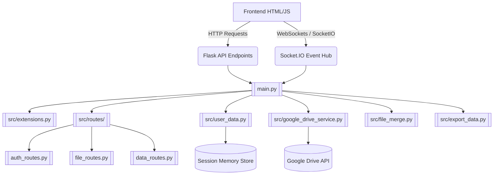

# Codebase & Functional Flow (Online Branch)

This file serves as the primary orientation for any AI agent or developer regarding the **Online** branch of the `microalbumin-Flask` project. **Before writing code, study the relationships and file structures documented here.**

## 1. Project Overview
The `online` branch contains the **Cloud Hosted Web Application** (Easy OKAPI).
It is a Flask-based web application deployed on online hosts (e.g., Heroku via `gunicorn`). Unlike the `main` branch, this version is decoupled from physical hardware (PyBadge). 

Instead of reading a local USB port, the application gets its data through:
1. Direct User File Uploads (`.csv` and `.json` standard curves).
2. Google Drive Integration (syncing sessions and folders).

The application provides a Web GUI for users to:
1. Browse their uploaded data or Google Drive synced `.csv` data (kept in an in-memory or pseudo-virtual database instead of the server's local file system).
2. Conduct analysis and generate Standard Curves (`kinetics`, `point`, `calibrate`).
3. View dynamically generated HTML dashboard plots using Socket.IO updates for live responsiveness across sessions.

### 2. Architecture & Relationships


### 2.1 Backend (`main.py` — entry point)

The Flask app is refactored using **Blueprints** to ensure maintainability:

| Component | Blueprint / Module | Responsibility |
|---|---|---|
| Core | `main.py` | App initialization, SocketIO setup, Base routes (`/`, `/ping`) |
| Auth | `src/routes/auth_routes.py` | Google Drive OAuth2 flow and sync operations |
| Account | `src/routes/account_routes.py` | User registration, login, password reset, account deletion, download, **AI activation** |
| File Ops | `src/routes/file_routes.py` | CSV/JSON CRUD operations (Edit, Delete, Copy, Upload, Merge) |
| Data API | `src/routes/data_routes.py` | Data fetching, Header parsing, CSV/JSON metadata export |
| AI | `src/routes/ai_routes.py` | AI assistant: chat, settings, guides, **desktop proxy** (`/ai/*`) |
| Extensions | `src/extensions.py` | Centralized SocketIO instance to avoid circular imports |

### 2.2 Backend Modules (`src/`)

| Module                                                   | Purpose                                                                                   |
| -------------------------------------------------------- | ----------------------------------------------------------------------------------------- |
| [[src/user_data.py\|user_data.py]]                       | In-memory per-session storage (`USER_DATA` dict), session management, Drive state helpers |
| [[src/google_drive_service.py\|google_drive_service.py]] | OAuth 2.0 flow, Drive CRUD operations (folders, files), session-to-Drive sync             |
| `config.py`                                              | Configuration class (`Config`): secret keys, Google/AI API settings, PRODUCTION_MODE      |
| `export_data.py`                                         | CSV metadata parsing, header writing, export utilities with thread locks                  |
| [[src/export_cal_json.py\|export_cal_json.py]]           | Standard curve coefficient processing, JSON export for calibration data                   |
| [[src/file_merge.py\|file_merge.py]]                     | Merging CSV contents from two files                                                       |
| `file_path.py`                                           | File path utilities                                                                       |
| `get_next_filename.py`                                   | Auto-naming duplicates (e.g., `file_1.csv`, `file_2.csv`)                                 |
| `mode.py`                                                | Returns available measurement modes: `kinetics`, `point`, `calibrate`                     |
| `quantity.py`                                            | Returns available quantity options for kinetics analysis                                  |
| `range.py`                                               | Returns display range input configuration                                                 |
| `ai_assistant.py`                                        | Groq API client, guide training, MCP tools, chat_stream generator (multilingual)          |
| `ai_settings.py`                                         | Per-session AI settings via Flask session (enabled, preferred_languages, first_run_shown) |
| `download_service.py`                                    | JWT helpers: generate/validate download tokens (30 min) and activation tokens (permanent) |

### 2.3 Frontend (`static/script/` — 12 JS files)

| File | Responsibility |
|---|---|
| `short-hands.js` | DOM utility helpers (`$id`, `$text`, `$hidden`, `fetchJSON`, etc.) |
| `init.js` | Page initialization, event listeners, mode/filter setup, socket.io connection |
| `index.js` | `AppState` global state object, mode switching logic, directory updates, `checkServerStatus` |
| [[static/script/navigation.js\|navigation.js]] | File table population (CSV and JSON), directory browsing, `browseSavingLocation` |
| `data-handling.js` | File select/deselect/delete/copy/upload/download, data fetching, export logic |
| `data-display.js` | Chart rendering orchestration, multi-source handling, calibration routines, analysis formatting |
| `generate-chart.js` | Chart.js chart creation, dataset construction, annotations, scales |
| `calculate.js` | Math: regression (linear, polynomial, logarithmic, exponential, Michaelis-Menten), kinetics quantities, R² |
| `edit-file.js` | SweetAlert2-based file editor modal (CSV and JSON), column operations, JSON graphic UI |
| `drive-integration.js` | Google Drive OAuth UI, folder selection, sync/load operations, auto-sync on close |
| `user-guide.js` | Interactive step-by-step user guide with spotlight overlay |

### 2.4 Templates (`templates/`)

| File | Purpose |
|---|---|
| [[templates/index.html\|index.html]] | Main SPA template (~419 lines). Jinja2-rendered with server-side data. Contains all UI sections. |
| `goodbye.html` | Displayed on shutdown (not used in online version) |

---

## 2.5 Account System (User Login & Registration)

The app includes a persistent account system backed by a **PostgreSQL** database (Heroku Postgres in production, SQLite locally). Users register to gain a time-limited download token for the Easy OKAPI desktop application.

### Data Model — `users` table (`src/account.py`)

| Column | Type | Notes |
|---|---|---|
| `id` | Integer PK | |
| `email` | String(255), unique | Lowercased on write |
| `name` | String(255) | Display name |
| `password_hash` | String(255) | bcrypt hash |
| `is_verified` | Boolean | Must be `TRUE` before login is allowed |
| `verification_token` | String(128) | Expires in 24 hours |
| `verification_expires` | DateTime | |
| `reset_token` | String(128) | Expires in 1 hour |
| `reset_expires` | DateTime | |
| `created_at` | DateTime | UTC |
| `last_download` | DateTime | Updated on each `/api/download` call |

### User Flows & Routes (`src/routes/account_routes.py`)

| Flow | Method | Route | Notes |
|---|---|---|---|
| Sign-up page | GET | `/account/signup` | Renders `signup.html` |
| Register | POST | `/api/account/register` | Creates user, sends verification email |
| Verify email | GET | `/api/account/verify/<token>` | Token expires in 24 h; sets `is_verified = TRUE` |
| Login page | GET | `/account/login` | Renders `login.html` |
| Login | POST | `/api/account/login` | Returns JWT download token (30 min); sets `account_user_id` in session |
| Forgot password | GET/POST | `/account/forgot-password`, `/api/account/forgot-password` | Sends reset email if account is verified |
| Reset password | GET | `/account/reset-password/<token>` | Renders reset form; token expires in 1 h |
| Reset password | POST | `/api/account/reset-password` | Updates password hash |
| Get token | POST | `/api/account/token` | Refreshes download token for logged-in user |
| **Activate AI** | POST | `/api/activate` | Exchanges a 30-min download token for a permanent activation token |
| Logout | POST | `/api/account/logout` | Clears session keys |
| Delete account | POST | `/api/account/delete` | Requires password; wipes Firebase data, Redis cache, DB row |
| Download | GET | `/api/download` | Validates JWT token; proxies GitHub release tarball to user |

### Session Keys

When a user logs in, three keys are written to the Flask `session`:
- `account_user_id` — integer DB primary key
- `account_user_name` — display name
- `account_user_email` — email address

The `index` route checks `session['account_user_id']` to pass an `account_user` dict to the template.

### Email Service

Transactional emails are sent via SMTP (configured through `SMTP_*` env vars). Two templates are used:
- **Verification email** — sent on registration; links to `/api/account/verify/<token>`
- **Password reset email** — sent on forgot-password; links to `/account/reset-password/<token>`

### Useful Database Commands (Heroku)

```bash
# List all users
heroku pg:psql --app easysensor-kit -c "SELECT id, email, name, is_verified, created_at, last_download FROM users;"

# Check a specific user
heroku pg:psql --app easysensor-kit -c "SELECT * FROM users WHERE email = 'user@example.com';"

# Manually verify a user (e.g. when verification email was missed)
heroku pg:psql --app easysensor-kit -c "UPDATE users SET is_verified = TRUE WHERE email = 'user@example.com';"

# Count registered users
heroku pg:psql --app easysensor-kit -c "SELECT COUNT(*) FROM users;"

# Check database connection and plan info
heroku addons:info heroku-postgresql --app easysensor-kit
```

---

## 3. Build & Deployment Pipeline

### 3.1 Build Process (`npm run build` → `node build.js`)

The build script performs:
1. **Copy static assets** (images, fonts) to `static/dist/`
2. **Obfuscate + minify JS** using `javascript-obfuscator` + `terser` → output as `*.min.js` in `static/dist/`
3. **Minify CSS** using `clean-css` → output as `*.min.css` in `static/dist/`

> The obfuscator auto-detects reserved function names from HTML `onclick` attributes, `data-action` attributes, and inline `<script>` blocks to avoid breaking references.

### 3.2 Heroku Deployment

```bash
# Build is triggered automatically via heroku-postbuild
npm run build

# Deploy
git push heroku online:main
```

- [[Procfile]]: `web: gunicorn -k eventlet --workers 1 main:app`
- [[runtime.txt]]: `python-3.12.11`
- [[package.json]] includes `"heroku-postbuild": "npm run build"` to run obfuscation on deploy

### 3.3 Environment Variables Required

| Variable | Purpose |
|---|---|
| `SECRET_KEY` | Flask session encryption |
| `DATABASE_URL` | PostgreSQL URL (Heroku Postgres add-on sets this automatically) |
| `GOOGLE_ENCRYPTION_KEY` | Decrypts `credentials.enc` for Google Drive OAuth |
| `GOOGLE_REDIRECT_URI` | OAuth callback URL (defaults to `http://localhost:5003/auth/google/callback`) |
| `GROQ_API_KEY` | Groq API key for the AI assistant |
| `SMTP_HOST` | SMTP server for sending emails (default: `smtp.gmail.com`) |
| `SMTP_PORT` | SMTP port (default: `587`) |
| `SMTP_USER` | Sender email address |
| `SMTP_PASS` | SMTP app password |
| `APP_BASE_URL` | Public URL used in verification/reset emails |
| `APP_RELEASE_TAG` | GitHub release tag to serve on download (default: `latest`) |
| `GITHUB_PAT` | GitHub Personal Access Token for proxying the release tarball |

---

## 4. Directory Structure (Online Branch)

```
microalbumin-Flask/
├── main.py                     # Flask app entry point (all routes)
├── Procfile                    # Heroku process config
├── runtime.txt                 # Python version for Heroku
├── requirements.txt            # Python dependencies
├── package.json                # Node.js build config
├── build.js                    # Obfuscation + minification build script
├── credentials.enc             # Encrypted Google OAuth credentials
├── .env                        # Environment variables (local dev)
├── .gitignore
├── src/
│   ├── config.py               # App configuration
│   ├── user_data.py            # In-memory per-session data store
│   ├── google_drive_service.py # Google Drive API integration
│   ├── export_data.py          # CSV export utilities
│   ├── export_cal_json.py      # Calibration JSON export
│   ├── file_merge.py           # CSV merge logic
│   ├── file_path.py            # Path utilities
│   ├── get_next_filename.py    # Auto-naming for duplicates
│   ├── mode.py                 # Measurement mode definitions
│   ├── quantity.py             # Quantity input definitions
│   └── range.py                # Display range definitions
├── static/
│   ├── style.css               # Source CSS (development)
│   ├── script/                 # Source JS (development)
│   │   ├── short-hands.js
│   │   ├── init.js
│   │   ├── index.js
│   │   ├── navigation.js
│   │   ├── data-handling.js
│   │   ├── data-display.js
│   │   ├── generate-chart.js
│   │   ├── calculate.js
│   │   ├── edit-file.js
│   │   ├── drive-integration.js
│   │   └── user-guide.js
│   └── dist/                   # Built/minified assets (auto-generated)
├── templates/
│   ├── index.html              # Main SPA template
│   └── goodbye.html
├── csv/                        # Default sample CSV data
├── json/                       # Default sample JSON data
└── images/                     # README screenshots
```

---

---

## 5. AI Proxy Architecture (Desktop → Heroku → Groq)

### 5.1 Purpose

The `GROQ_API_KEY` lives **only** on the Heroku server. Desktop app packages never contain it. A verified Easy OKAPI account holder exchanges a short-lived download token for a permanent activation token stored locally. Every AI request from the desktop is routed through Heroku, which validates the token against the database before calling Groq.

### 5.2 Token Lifecycle

```
User registers & verifies email
          │
          ▼
    POST /api/account/login
    ◄── { download_token }      ← JWT, 30-min TTL
    payload: { sub, email, purpose:"app_download", iat, exp }
          │
          │  (installer or in-app form)
          ▼
    POST /api/activate  { token: <download_token> }
          │  server validates expiry + DB lookup
    ◄── { status:"success", license_token }
    payload: same as above but exp STRIPPED — permanent
          │
          ▼
    Saved to  activation.json  on the user's local machine
```

**Key rules:**
- Download token: 30-minute expiry, validated with `validate_download_token()` (checks `exp`).
- Activation token: no expiry, re-signed with the same `SECRET_KEY`, validated with `validate_activation_token()` (`options={'verify_exp': False}`).
- Both tokens carry `purpose: "app_download"` — a wrong-purpose token is rejected even if the signature is valid.
- The activation token is **not stored on the server**; the server only keeps the DB row.

### 5.3 Chat Proxy Flow

```
Desktop app
  │
  │  POST /ai/proxy/chat
  │  body: { license_token, messages, language, model, ui_context }
  ▼
Heroku  (src/routes/ai_routes.py  →  proxy_chat())
  │
  ├─ 1. validate_activation_token(license_token)
  │      → checks JWT signature + purpose field
  │      → raises InvalidTokenError → 401
  │
  ├─ 2. User.query.get(payload['sub'])
  │      → account missing or is_verified=False → 403
  │
  ├─ 3. Config.GROQ_API_KEY present?
  │      → missing → 503
  │
  └─ 4. ai_assistant.chat_stream(messages, language, GROQ_API_KEY, model, ui_context)
         → streams SSE events back to desktop
         → each event: data: {"type":"chunk","content":"..."}\n\n
         → terminated with: data: [DONE]\n\n
```

The desktop's `proxy_chat_stream()` (`src/ai_assistant.py`) makes the HTTP POST with `stream=True`, iterates `iter_lines()`, and re-yields parsed event dicts. The SSE format is identical to the direct Groq path so the frontend renders both the same way.

### 5.4 Files Involved

| File | Branch | Role |
|---|---|---|
| `src/download_service.py` | online | `generate_download_token`, `validate_download_token`, `issue_activation_token`, `validate_activation_token` |
| `src/routes/account_routes.py` | online | `POST /api/activate` — exchanges download token for activation token |
| `src/routes/ai_routes.py` | online | `POST /ai/proxy/chat` — validates token + streams Groq response |
| `src/config.py` | online | `Config.GROQ_API_KEY`, `Config.AI_MODEL` |
| `src/activation.py` | main | Reads/writes `activation.json`; exposes `get_license_token()`, `AI_SERVICE_URL` |
| `src/routes/ai_routes.py` | main | `POST /ai/activate` (calls online `/api/activate`); `/ai/chat` dispatches proxy vs dev mode |
| `src/ai_assistant.py` | main | `proxy_chat_stream()` — HTTP client that calls `/ai/proxy/chat` and re-yields SSE |
| `activation.json` | main (runtime) | `{ "license_token": "..." }` — written on first activation, gitignored |

### 5.5 Access Mode Decision (`main` branch)

`_get_api_mode()` in `src/routes/ai_routes.py`:

```
activation.json  →  license_token present?
    YES  →  mode = "proxy"   (credential = license_token)
    NO   →  GROQ_API_KEY in .env?
                YES  →  mode = "dev"    (credential = api_key, dev machines only)
                NO   →  mode = None     (503 — AI not activated)
```

### 5.6 Security Properties

| Property | Mechanism |
|---|---|
| Key never shipped with app | `GROQ_API_KEY` is a Heroku config var; absent from all git branches |
| Signature tamper-proof | HS256 signed with `SECRET_KEY`; forged tokens fail `validate_activation_token` |
| Revocable per-user | DB lookup on every proxy request; deleting or unverifying the account blocks the next call |
| Token reuse across reinstalls | Activation token has no expiry; user pastes the same token after reinstalling |
| Dev override | `.env` `GROQ_API_KEY` bypasses activation — only works on developer machines |

---

## 6. Key Differences from `main` Branch (Summary)

| Aspect | `online` branch | `main` branch (expected) |
|---|---|---|
| Data storage | In-memory `USER_DATA` dict | Local filesystem |
| Directory browsing | N/A (upload-based) | OS directory picker |
| HID logging | Disabled | Enabled (PyBadge USB) |
| Users | Multi-user with sessions | Single user |
| Google Drive | Integrated (OAuth 2.0) | Not needed |
| Static serving | From `static/dist/` (obfuscated) | From `static/` (source) |
| Build step | Required (`npm run build`) | Not required |
| Deployment | Heroku | Local machine |
| `static_folder` | `'static/dist'` | `'static'` |
| Shutdown endpoint | Not applicable | Present |
| `PRODUCTION_MODE` | `True` | `False` |
| AI backend | Direct Groq call (`chat_stream`) | Proxy to Heroku (`proxy_chat_stream`), falls back to direct if `GROQ_API_KEY` in `.env` |
| AI key location | `GROQ_API_KEY` Heroku config var | Never stored locally; accessed via activation token |
| AI activation | N/A — always direct | `POST /ai/activate` → exchanges download token → writes `activation.json` |
