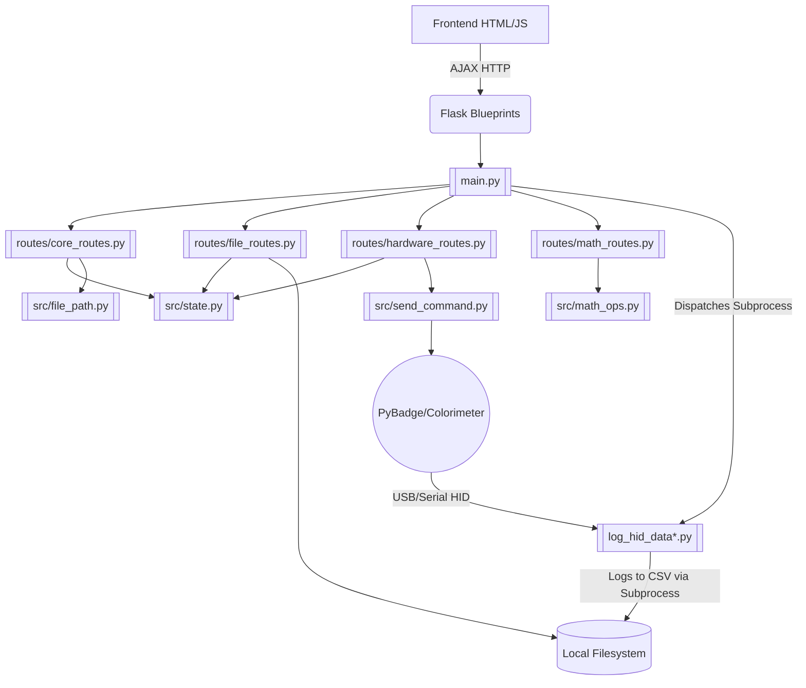

# Codebase & Functional Flow (Main Branch)

This file serves as the primary orientation for any AI agent or developer regarding the **Main** branch of the `microalbumin-Flask` project. **Before writing code, study the relationships and file structures documented here.**

## 1. Project Overview
The `main` branch contains the **Local Desktop/Web Application** (Easy OKAPI) — version **1.0.10**.
It is a Flask-based web application meant to run locally on a user's machine (Windows or Mac). It communicates with a physical colorimeter device (powered by a PyBadge with CircuitPython) over USB/Serial connection using HID. 

The application provides a Web GUI (via Flask templates and vanilla JavaScript) for users to:
1. Log raw measurement data directly from the PyBadge into local `.csv` files.
2. Browse local directories to view recorded `.csv` data.
3. Conduct analysis and generate Standard Curves based on measurement modes (`kinetics`, `point`, `calibrate`).
4. Perform local file operations (copy, edit, delete `.csv` and `.json` standard curve files).
5. Generate, save, and manage HTML analysis reports organized by subject.

## 2. Architecture Overview



### 2.1 Backend (`main.py` — 197-line thin entry point)

`main.py` handles only: imports, startup progress reporting, CLI argument parsing, blueprint registration, browser launch, atexit cleanup, signal handlers, and `app.run()`.

**All routes live in Flask blueprints under `src/routes/`:**

| Blueprint | File | Routes | Frontend Consumer |
|---|---|---|---|
| `core_bp` | `core_routes.py` | `/ping`, `/clear_cache`, `/clear_logs`, `/`, `/shutdown`, `/browse`, `/browse_export`, `/get_data_folders`, `/get_json_cal`, `/get_report_subjects`, `/settings` (GET+POST) | `index.js`, `navigation.js`, `report.js`, `init.js` |
| `file_bp` | `file_routes.py` | `/get_json_content`, `/get_csv_headers`, `/api/current_output`, `/edit_file`, `/delete_file`, `/copy_file`, `/merge_csv`, `/remove_columns`, `/get_num_sources`, `/get_data`, `/get_file_content`, `/export_data`, `/export_cal_coefs`, `/get_calibration_json_list`, `/save_report`, `/export_to_report`, `/get_report_items`, `/delete_report_subject`, `/copy_report_subject`, `/rename_report_subject` | `navigation.js`, `data-handling.js`, `edit-file.js`, `data-display.js`, `report.js` |
| `hardware_bp` | `hardware_routes.py` | `/run_script`, `/check_status`, `/terminate_script`, `/get_logs` | `hid-logging.js` |
| `math_bp` | `math_routes.py` | `/calculate_coef_and_rsquared`, `/calculate_kinetics_quantities` | `calculate.js`, `data-display.js` |
| `ai_bp` | `ai_routes.py` | `/ai/status`, `/ai/chat`, `/ai/settings` (GET+POST), `/ai/activate`, `/ai/guides` | `ai-chat.js` |

* **Filesystem-based data storage**: All CSV and JSON files are read/written to the local filesystem.
* **Auto-browser launch**: `browser_mgt.py` opens the default browser on server init.
* **Single-user process**: No isolation, no sessions, straight port serving.
* **Startup progress reporter**: Writes `pct label\n` lines to `/tmp/easyokapi_progress.pipe` (Mac) or `%TEMP%\easyokapi_progress.txt` (Windows) for launch-script progress bars.
* **CLI flags**: `--port` (default 5099), `--alias` (default `easyokapi.com`), `--verbose` / `-v`, `--mem-monitor`.

### 2.2 Backend Modules (`src/`)

| Module | Purpose |
|---|---|
| `state.py` | **Global state singleton**: `process`, `monitor_thread`, `args`, `script_dir`, `log_file`, `json_root_path`, `report_root_path`, `os_name`, `delimiter`, `PRODUCTION_MODE` |
| `validators.py` | `@validate_json(schema)` decorator — validates and coerces JSON request payloads; injects `validated_data` kwarg into route handlers |
| `math_ops.py` | Server-side regression: `calculate_coef_and_rsquared`, `calculate_kinetics_quantities`, `map_duplicates`, `get_rsquared_threshold` — uses `scipy.optimize.curve_fit` and `numpy` |
| `file_path.py` | Data-folder constants and helpers: `DATA_ROOT`, `validate_in_data_root(path)`, `get_data_subfolders()`, `is_multi_value_timeseries_csv_header()`. CSV schema utilities: `parse_csv_metadata(lines)` (canonical `# Key: Value` parser), `detect_csv_schema(header_line)` (returns `CSV_SCHEMA_TIMESERIES / KINETICS_CAL / POINT_CAL`). No mutable state. |
| `file.py` | File operations: `get_file_list` (glob), `_read_csv_raw` (shared CSV reader: returns meta lines + headers + rows), `get_dynamic_data` (parse CSV/JSON from disk), `merge_csv_files`, `replace_empty` |
| `file_operations.py` | `remove_csv_columns` — removes columns from CSV files on disk, renumbers `Value:` columns |
| `measure.py` | `sort_csv_file` — sorts calibration CSV data on disk by concentration |
| `browser_mgt.py` | `open_browser`, `close_port`, `cleanup`, `ensure_host_mapping` — browser/process lifecycle |
| `script_monitor.py` | `check_log_for_errors` — scans `log/script_logs.txt` for PyBadge errors |
| `send_command.py` | `connect_to_device` (find PyBadge via serial), `send_command_and_wait_ack` (serial protocol) |
| `ai_assistant.py` | Groq chat (`_groq_chat`, `chat_stream`), MCP tool engine, multilingual system prompts, `proxy_chat_stream()` for desktop proxy mode |
| `ai_settings.py` | Load/save `ai_settings.json`; language defaults; `SUPPORTED_LANGUAGES` catalog; strips obsolete keys on read |
| `user_settings.py` | Load/save `user_settings.json`; user UI preferences: `theme`, `default_mode`, `default_window_size`, `default_subfolder` |
| `activation.py` | Reads/writes `activation.json`; `get_license_token()` and `AI_SERVICE_URL` constant for proxy mode |
| `export_data.py` | CSV metadata parsing, header writing, sort by concentration |
| `export_cal_json.py` | Standard curve coefficient processing, JSON export for calibration data |
| `get_next_filename.py` | Auto-naming duplicates (e.g., `file_1.csv`) |
| `mode.py` | Returns available measurement modes: `kinetics`, `point`, `calibrate` |
| `quantity.py` | Returns available quantity options for kinetics analysis |
| `range.py` | Returns display range input configuration |
| `routes/__init__.py` | Empty package marker |

### 2.3 HID Data Collection (`log_hid_data.py`)
Collects and decodes incoming data from Adafruit PyBadge via `hidapi` over USB connection, spawning into log files configured via parameters.

### 2.4 Frontend (`static/script/` — 12 JS files)

| File | Responsibility |
|---|---|
| `short-hands.js` | DOM utility helpers (`$id`, `$text`, `$hidden`, etc.) |
| `init.js` | Page initialization, event listeners, mode/filter setup |
| `index.js` | `AppState` global state, mode switching, directory updates, `checkServerStatus` |
| `navigation.js` | File table population (CSV and JSON), **data subfolder picker** (`loadDataFolders`, `selectDataFolder`, `filterDataFolderList`, `updateFolderListSelection`) |
| `hid-logging.js` | **PyBadge control UI**: `runScript`, `terminateScript`, `checkScriptStatus`, log display |
| `data-handling.js` | File select/deselect/delete/copy, data fetching, export logic |
| `data-display.js` | Chart rendering orchestration, multi-source handling, calibration routines |
| `generate-chart.js` | Chart.js chart creation, dataset construction, annotations |
| `calculate.js` | Math: regression (linear, polynomial, logarithmic, exponential, Michaelis-Menten), R²; calls `/calculate_coef_and_rsquared` for server-side computation |
| `edit-file.js` | SweetAlert2-based file editor modal (CSV and JSON), column operations |
| `report.js` | Report generation (`generateReport`), subject CRUD UI (create/rename/copy/delete subjects, export to subject, view items) |
| `user-guide.js` | Interactive step-by-step user guide with spotlight overlay |
| `ai-chat.js` | Floating AI chat widget: panel toggle, multilingual language selector, settings panel, model download progress, conversation history |

### 2.5 Templates (`templates/`)

| File | Purpose |
|---|---|
| `index.html` | Main SPA template. Jinja2-rendered with server-side data: `data_root`, `report_root`, `json_root` path constants (instead of `directory`), plus file list, mode, quantity, delimiter, etc. |
| `goodbye.html` | Displayed on `/shutdown` — shows farewell screen before process termination |

---

## 3. Report System

Reports are generated as standalone HTML files and organized under `report/<subject>/`.

| Route | Method | Purpose |
|---|---|---|
| `/get_report_subjects` | GET | List subject subdirectories in `report/` |
| `/save_report` | POST | Save HTML report to `report/<filename>/` |
| `/export_to_report` | POST | Copy a report HTML file into a named subject folder |
| `/get_report_items` | GET | List HTML files within a subject folder |
| `/delete_report_subject` | POST | Delete a subject folder and all its reports |
| `/copy_report_subject` | POST | Duplicate a subject folder |
| `/rename_report_subject` | POST | Rename a subject folder |

---

## 4. Math API

Regression is computed **server-side** via `math_ops.py` (scipy + numpy), exposed as REST endpoints. The JS client calls these for calibration and kinetics analysis.

| Route | Method | Payload | Returns |
|---|---|---|---|
| `/calculate_coef_and_rsquared` | POST | `{x, y, regress_algo}` | `{slope, rSquared, coefficients}` |
| `/calculate_kinetics_quantities` | POST | `{XColumn, YColumn, window_size}` | kinetics analysis object |

Supported algorithms: `linear`, `polynomial`, `logarithmic`, `exponential`, `Michaelis-Menten`.

---

## 5. AI Assistant

### 5.1 Overview
A floating chat widget (bottom-right corner) powered by **Groq** (cloud LLM API). No local model download is required. The `GROQ_API_KEY` lives only on the online server (Heroku config var); desktop instances authenticate via a locally stored activation token rather than holding the key directly. Settings are persisted in `ai_settings.json` at the project root.

### 5.2 Supported Languages
English (en), Vietnamese (vi), Chinese Simplified (zh), French (fr), Japanese (ja), Russian (ru).

### 5.3 Default Model
`llama-3.1-8b-instant` (Groq). Override with `AI_MODEL` environment variable.

### 5.4 MCP Tools (available to the LLM — main branch only)
| Tool | Description |
|---|---|
| `get_app_context` | Current directory, CSV/JSON file lists, HID subprocess status |
| `read_csv_file` | Read a CSV file (metadata + first N rows) |
| `read_calibration_file` | Read a JSON calibration file from `json/<mode>/` |
| `get_hardware_status` | PyBadge subprocess running/stopped |
| `get_help_topic` | Built-in docs for a feature topic |
| `trigger_guide` | Launch a full preset workflow guide |
| `trigger_custom_steps` | Launch a focused spotlight guide for specific UI elements |

### 5.5 Routes (main branch)
| Route | Method | Purpose |
|---|---|---|
| `/ai/status` | GET | API readiness, activation state, settings |
| `/ai/chat` | POST | Send messages → SSE stream (proxied or dev-direct) |
| `/ai/activate` | POST | Exchange Easy OKAPI download token for local activation token |
| `/ai/settings` | GET | Return current settings |
| `/ai/settings` | POST | Update settings (language, enabled) |
| `/ai/guides` | GET | Return guide examples for a given language |

### 5.6 Settings file (`ai_settings.json`)
```json
{
  "enabled": true,
  "preferred_languages": ["en", "vi"],
  "first_run_shown": false
}
```
`preferred_languages` is an array of 1–6 language codes. The in-app language button cycles through the selected languages. Files that still contain the obsolete `preferred_language` string key are silently migrated on read by `ai_settings.py`.

### 5.7 Activation file (`activation.json`)
```json
{
  "license_token": "<permanent JWT>"
}
```
Written to the project root during installation or via the in-app activation form. Read by `src/activation.py`. If absent and no `GROQ_API_KEY` is set in `.env`, the AI widget shows "Not activated" and requests a token.

### 5.8 Setup flow for new users
**Option A — During installation (recommended):**
- Mac: `setup-2-install-venv.command` / `installer-mac/install-venv.command` prompt for language preferences, then ask for the Easy OKAPI download token and call `POST /api/activate` on the server. `activation.json` is written automatically.
- Windows: `startwindow-4-venv-run.bat` does the same via `curl` + Python JSON parsing.

**Option B — After installation, from inside the app:**
1. Click the **🤖 AI Assistant** button (bottom-right of the page).
2. If "Not activated" is shown, paste the Easy OKAPI download token from `easyokapi.cbbiotec.vn` into the activation input and click **Activate**.
3. The app calls `POST /ai/activate`, which exchanges the token with the server and writes `activation.json` locally.

**Developer mode (no activation required):**
Set `GROQ_API_KEY` in `.env`. The app detects this and calls Groq directly, bypassing the proxy. Never ship `.env` with a real key.

---

## 6. Installation & Startup

### 5.1 Mac
```bash
# Option A: Installer (.dmg)
# Option B: Scripts
./setup-1-install-pyenv.command   # Install homebrew, pyenv, python
./setup-2-install-venv.command    # Install dependencies to venv/
./setup-3-run.command             # Start the application
```

### 5.2 Windows
Requires `libusbK` driver installed via Zadig for PyBadge HID access.
```cmd
startwindow-1-git.bat
startwindow-2-pyenv.bat
startwindow-3-python.bat
startwindow-4-venv-run.bat
```

### 5.3 Direct Python
```bash
python main.py --port 5099 --alias easyokapi.com
python main.py --verbose          # show HTTP logs + backend prints
python main.py --mem-monitor      # enable tracemalloc memory growth tracking
```

---

## 6. Directory Structure (Main Branch)

```
microalbumin-Flask/
├── CLAUDE.md                   # Claude Code entry point
├── Rule.md                     # AI coding rules
├── main.py                     # Flask app entry point (197 lines, blueprint registration only)
├── log_hid_data.py             # HID data collection (Mac, hidapi)
├── log_hid_data_pyusb.py       # HID data collection (Windows, pyusb)
├── requirements.txt            # Python dependencies
├── requirements-win.txt        # Windows-specific dependencies
├── setup-*.command             # Mac utility startup scripts
├── startwindow-*.bat           # Windows utility startup scripts
├── installer-mac/              # Mac .dmg installer assets
├── installer-win/              # Windows .exe installer assets
├── src/
│   ├── state.py                # Global state singleton
│   ├── validators.py           # @validate_json decorator
│   ├── math_ops.py             # Server-side regression (scipy/numpy)
│   ├── routes/
│   │   ├── __init__.py
│   │   ├── core_routes.py      # Core + browse + report subjects
│   │   ├── file_routes.py      # CSV/JSON CRUD + report CRUD
│   │   ├── hardware_routes.py  # HID subprocess control
│   │   └── math_routes.py      # Regression math API
│   ├── browser_mgt.py
│   ├── export_cal_json.py
│   ├── export_data.py
│   ├── file.py
│   ├── file_operations.py
│   ├── file_path.py
│   ├── get_next_filename.py
│   ├── measure.py
│   ├── mode.py
│   ├── quantity.py
│   ├── range.py
│   ├── script_monitor.py
│   └── send_command.py
├── static/
│   ├── style.css
│   └── script/
│       ├── calculate.js
│       ├── data-display.js
│       ├── data-handling.js
│       ├── edit-file.js
│       ├── generate-chart.js
│       ├── hid-logging.js
│       ├── index.js
│       ├── init.js
│       ├── navigation.js
│       ├── report.js           # Report generation + subject CRUD
│       ├── short-hands.js
│       ├── user-guide.js       # Interactive user guide
│       └── ai-chat.js          # Floating AI chat widget
├── templates/
│   ├── index.html
│   └── goodbye.html
├── data/                       # All user CSV data (auto-created); browsing restricted to here
│   └── <subfolder>/            # User-named subfolders (created on HID run or manually)
├── json/                       # Standard curve JSON files
├── log/                        # Script logs directory
├── report/                     # Saved HTML reports (by subject subdirectory)
├── ai_settings.json            # AI assistant settings (auto-created)
├── user_settings.json          # User UI preferences (auto-created, gitignored)
└── sample_data/
```

---

## 6. RAG User Guide Subsystem

A local Retrieval-Augmented Generation pipeline is planned to replace the current keyword-based few-shot injection for the AI-driven user guide. Full architecture, data-flow diagrams, component map, and phased implementation plan are in:

**`easyokapi-knowledge/RAG-USER-GUIDE.md`**

Current state: keyword scan in `_match_guide_example()` (`src/ai_assistant.py:25`) reading `guide_training.json`. Planned replacement: semantic vector search via ChromaDB with a cloud-compatible embedding model, implemented in `src/rag_guide.py` (not yet created).

---

## 7. AI Proxy Architecture

The `GROQ_API_KEY` never ships inside the desktop app package. It lives only as a Heroku config var on the online server. Desktop instances access Groq through a two-phase token mechanism.

### 7.1 Token Lifecycle

```
User logs in at easyokapi.cbbiotec.vn
           │
           ▼
  ┌─────────────────────────────────┐
  │  Download token  (30-min JWT)   │  purpose: "app_download"
  │  {"sub":"42", "exp": now+1800}  │  signed with SECRET_KEY
  └────────────────┬────────────────┘
                   │
       ┌───────────┴────────────┐
       │  hits /api/download    │  gets app tarball from GitHub
       │  hits /api/activate    │  exchanges for permanent token
       └───────────┬────────────┘
                   │  server: validates sig + exp, checks User DB
                   ▼
  ┌─────────────────────────────────┐
  │  Activation token  (permanent)  │  same payload, exp stripped
  │  {"sub":"42", ...}              │  written to activation.json
  └────────────────┬────────────────┘
                   │  stored on disk, never in URLs
                   ▼
  Desktop app → POST /ai/proxy/chat {messages, license_token}
                   │  server: validates sig (no exp check)
                   │          User.query.get(sub) → is_verified ✓
                   │          calls Groq with server-side API key
                   ▼
  Streaming SSE response back to desktop app
```

### 7.2 Files Involved

**Main branch (desktop app):**

| File | Role |
|---|---|
| `src/activation.py` | Reads/writes `activation.json`; exposes `get_license_token()` and `AI_SERVICE_URL` |
| `src/routes/ai_routes.py` | `_get_api_mode()` selects proxy vs dev-direct; `POST /ai/activate` calls online server and saves token |
| `src/ai_assistant.py` | `proxy_chat_stream()` — HTTP POST to `/ai/proxy/chat`, iterates SSE lines, yields event dicts |
| `activation.json` | Permanent activation token stored at project root (gitignored) |
| `.env` | Dev-only `GROQ_API_KEY` override; commented out in production packages |

**Online branch (Heroku server):**

| File | Role |
|---|---|
| `src/download_service.py` | `issue_activation_token()` — strips `exp`, re-signs; `validate_activation_token()` — decodes without expiry check |
| `src/routes/account_routes.py` | `POST /api/activate` — validates 30-min download token, looks up `User`, returns permanent activation token |
| `src/routes/ai_routes.py` | `POST /ai/proxy/chat` — validates activation token, DB-checks account is still active, calls Groq, streams SSE |

### 7.3 API Mode Selection (main branch)

`_get_api_mode()` in `src/routes/ai_routes.py` returns the active mode on every request:

```
activation.json present?  →  mode = 'proxy'  (credential = license_token)
       ↓ no
GROQ_API_KEY in .env?     →  mode = 'dev'    (credential = api_key, calls Groq directly)
       ↓ no
                          →  mode = None      (AI widget shows "Not activated")
```

Proxy mode always takes priority over dev mode when both are present.

### 7.4 Security Properties

| Property | How it is achieved |
|---|---|
| `GROQ_API_KEY` never leaves Heroku | Only read from `Config.GROQ_API_KEY` inside `/ai/proxy/chat` |
| Activation requires a live account | `/api/activate` and `/ai/proxy/chat` both call `User.query.get()` + `is_verified` check |
| Stolen download URL has 30-min window | `validate_download_token` enforces `exp` on `/api/activate`; permanent token is issued server-side |
| Permanent token can be revoked | Deleting or un-verifying the user account blocks `/ai/proxy/chat` on the next request |
| Token not exposed in URLs | Activation token travels in POST body only; never in query strings or server logs |

---

## 8. Key Differences from `online` Branch (Summary)

| Aspect | `main` branch | `online` branch |
|---|---|---|
| Data storage | Local filesystem (`os`, `open`, `Path`) | In-memory `USER_DATA` dict |
| Directory browsing | OS filesystem navigation | N/A (upload-based) |
| HID logging | Enabled (PyBadge USB) | Disabled |
| Users | Single user, no sessions | Multi-user with Flask sessions |
| Google Drive | Not present | Integrated (OAuth 2.0) |
| Static serving | From `static/` (source) | From `static/dist/` (obfuscated) |
| Build step | Not required | Required (`npm run build`) |
| Deployment | Local machine | Heroku |
| Real-time | No SocketIO | Flask-SocketIO with eventlet |
| Flask version | 1.1.4 | Latest (with SocketIO support) |
| Shutdown endpoint | Present (`/shutdown`) | Not applicable |
| `PRODUCTION_MODE` | `True` (in `state.py`) | `True` (always) |
| Browser auto-launch | Yes (`browser_mgt.py`) | No |
| Installers | `.dmg` / `.exe` / batch scripts | N/A |
| Route organization | Flask blueprints in `src/routes/` | Monolithic `main.py` |
| Math computation | Server-side (`math_ops.py`, scipy) | Client-side JS only |
| AI backend | Groq via proxy (`activation.json`) | Groq direct (`GROQ_API_KEY` on Heroku) |
| AI key location | Never on client; proxied via Heroku | Heroku config var only |
