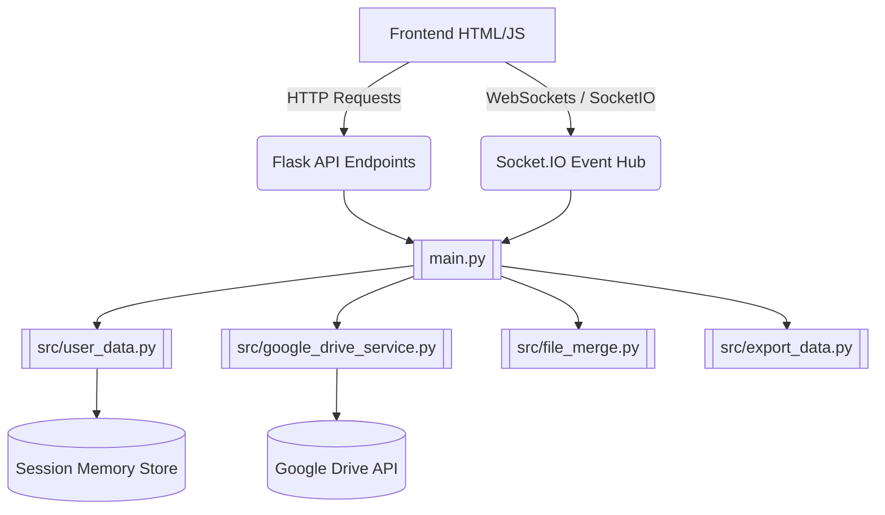

# Codebase & Functional Flow (Online Branch)

This file serves as the primary orientation for any AI agent or developer regarding the **Online** branch of the `microalbumin-Flask` project. **Before writing code, study the relationships and file structures documented here.**

## 1. Project Overview
The `online` branch contains the **Cloud Hosted Web Application** (Easy OKAPI).
It is a Flask-based web application deployed on online hosts (e.g., Heroku via `gunicorn`). Unlike the `main` branch, this version is decoupled from physical hardware (PyBadge). 

Instead of reading a local USB port, the application gets its data through:
1. Direct User File Uploads (`.csv` and `.json` standard curves).
2. Google Drive Integration (syncing sessions and folders).

The application provides a Web GUI for users to:
1. Browse their uploaded data or Google Drive synced `.csv` data (kept in an in-memory or pseudo-virtual database instead of the server's local file system).
2. Conduct analysis and generate Standard Curves (`kinetics`, `point`, `calibrate`).
3. View dynamically generated HTML dashboard plots using Socket.IO updates for live responsiveness across sessions.

## 2. Architecture & Relationships


### 2.1 Backend (`main.py` — single entry point, ~1078 lines)

The Flask app is organized into **regions** by the JS consumer:

| Region | Routes | Consumer |
|---|---|---|
| Region 1 | `/ping`, `/clear_cache`, `/`, `/get_csv`, `/get_json_cal` | `index.js` |
| Region 2 | `/get_json_content`, `/get_headers`, `/api/current_output` | `navigation.js` |
| Region 2.5 | `/auth/google/*`, `/drive/*` (13 endpoints) | `drive-integration.js` |
| Region 3 | `/edit_file`, `/delete_file`, `/copy_file`, `/upload_file`, `/merge_csv` | `edit-file.js` |
| (unlabelled) | `/get_num_sources`, `/get_data`, `/get_file_content`, `/export_data`, `/export_cal_coefs` | `data-handling.js`, `data-display.js` |

* **Session-based multi-user**: Each user gets a unique `user_id` via Flask `session`. User data is isolated in `USER_DATA[uid]`.
* **No filesystem access**: All user data is stored **in-memory**; absolutely no I/O reading/writing to the server's filesystem for user files.

### 2.2 Backend Modules (`src/`)

| Module | Purpose |
|---|---|
| [[src/user_data.py\|user_data.py]] | In-memory per-session storage (`USER_DATA` dict), session management, Drive state helpers |
| [[src/google_drive_service.py\|google_drive_service.py]] | OAuth 2.0 flow, Drive CRUD operations (folders, files), session-to-Drive sync |
| `config.py` | Configuration class (`Config`): secret keys, Google API settings, file size limits |
| `export_data.py` | CSV metadata parsing, header writing, export utilities with thread locks |
| [[src/export_cal_json.py\|export_cal_json.py]] | Standard curve coefficient processing, JSON export for calibration data |
| [[src/file_merge.py\|file_merge.py]] | Merging CSV contents from two files |
| `file_path.py` | File path utilities |
| `get_next_filename.py` | Auto-naming duplicates (e.g., `file_1.csv`, `file_2.csv`) |
| `mode.py` | Returns available measurement modes: `kinetics`, `point`, `calibrate` |
| `quantity.py` | Returns available quantity options for kinetics analysis |
| `range.py` | Returns display range input configuration |

### 2.3 Frontend (`static/script/` — 11 JS files)

| File | Responsibility |
|---|---|
| `short-hands.js` | DOM utility helpers (`$id`, `$text`, `$hidden`, `fetchJSON`, etc.) |
| `init.js` | Page initialization, event listeners, mode/filter setup, socket.io connection |
| `index.js` | `AppState` global state object, mode switching logic, directory updates, `checkServerStatus` |
| [[static/script/navigation.js\|navigation.js]] | File table population (CSV and JSON), directory browsing, `browseSavingLocation` |
| `data-handling.js` | File select/deselect/delete/copy/upload/download, data fetching, export logic |
| `data-display.js` | Chart rendering orchestration, multi-source handling, calibration routines, analysis formatting |
| `generate-chart.js` | Chart.js chart creation, dataset construction, annotations, scales |
| `calculate.js` | Math: regression (linear, polynomial, logarithmic, exponential, Michaelis-Menten), kinetics quantities, R² |
| `edit-file.js` | SweetAlert2-based file editor modal (CSV and JSON), column operations, JSON graphic UI |
| `drive-integration.js` | Google Drive OAuth UI, folder selection, sync/load operations, auto-sync on close |
| `user-guide.js` | Interactive step-by-step user guide with spotlight overlay |

### 2.4 Templates (`templates/`)

| File | Purpose |
|---|---|
| [[templates/index.html\|index.html]] | Main SPA template (~419 lines). Jinja2-rendered with server-side data. Contains all UI sections. |
| `goodbye.html` | Displayed on shutdown (not used in online version) |

---

## 3. Build & Deployment Pipeline

### 3.1 Build Process (`npm run build` → `node build.js`)

The build script performs:
1. **Copy static assets** (images, fonts) to `static/dist/`
2. **Obfuscate + minify JS** using `javascript-obfuscator` + `terser` → output as `*.min.js` in `static/dist/`
3. **Minify CSS** using `clean-css` → output as `*.min.css` in `static/dist/`

> The obfuscator auto-detects reserved function names from HTML `onclick` attributes, `data-action` attributes, and inline `<script>` blocks to avoid breaking references.

### 3.2 Heroku Deployment

```bash
# Build is triggered automatically via heroku-postbuild
npm run build

# Deploy
git push heroku online:main
```

- [[Procfile]]: `web: gunicorn -k eventlet --workers 1 main:app`
- [[runtime.txt]]: `python-3.12.11`
- [[package.json]] includes `"heroku-postbuild": "npm run build"` to run obfuscation on deploy

### 3.3 Environment Variables Required

| Variable | Purpose |
|---|---|
| `SECRET_KEY` | Flask session encryption |
| `GOOGLE_ENCRYPTION_KEY` | Decrypts `credentials.enc` for Google Drive OAuth |
| `GOOGLE_REDIRECT_URI` | OAuth callback URL (defaults to `http://localhost:5003/auth/google/callback`) |

---

## 4. Directory Structure (Online Branch)

```
microalbumin-Flask/
├── main.py                     # Flask app entry point (all routes)
├── Procfile                    # Heroku process config
├── runtime.txt                 # Python version for Heroku
├── requirements.txt            # Python dependencies
├── package.json                # Node.js build config
├── build.js                    # Obfuscation + minification build script
├── credentials.enc             # Encrypted Google OAuth credentials
├── .env                        # Environment variables (local dev)
├── .gitignore
├── src/
│   ├── config.py               # App configuration
│   ├── user_data.py            # In-memory per-session data store
│   ├── google_drive_service.py # Google Drive API integration
│   ├── export_data.py          # CSV export utilities
│   ├── export_cal_json.py      # Calibration JSON export
│   ├── file_merge.py           # CSV merge logic
│   ├── file_path.py            # Path utilities
│   ├── get_next_filename.py    # Auto-naming for duplicates
│   ├── mode.py                 # Measurement mode definitions
│   ├── quantity.py             # Quantity input definitions
│   └── range.py                # Display range definitions
├── static/
│   ├── style.css               # Source CSS (development)
│   ├── script/                 # Source JS (development)
│   │   ├── short-hands.js
│   │   ├── init.js
│   │   ├── index.js
│   │   ├── navigation.js
│   │   ├── data-handling.js
│   │   ├── data-display.js
│   │   ├── generate-chart.js
│   │   ├── calculate.js
│   │   ├── edit-file.js
│   │   ├── drive-integration.js
│   │   └── user-guide.js
│   └── dist/                   # Built/minified assets (auto-generated)
├── templates/
│   ├── index.html              # Main SPA template
│   └── goodbye.html
├── csv/                        # Default sample CSV data
├── json/                       # Default sample JSON data
└── images/                     # README screenshots
```

---

## 5. Key Differences from `main` Branch (Summary)

| Aspect | `online` branch | `main` branch (expected) |
|---|---|---|
| Data storage | In-memory `USER_DATA` dict | Local filesystem |
| Directory browsing | N/A (upload-based) | OS directory picker |
| HID logging | Disabled | Enabled (PyBadge USB) |
| Users | Multi-user with sessions | Single user |
| Google Drive | Integrated (OAuth 2.0) | Not needed |
| Static serving | From `static/dist/` (obfuscated) | From `static/` (source) |
| Build step | Required (`npm run build`) | Not required |
| Deployment | Heroku | Local machine |
| `static_folder` | `'static/dist'` | `'static'` |
| Shutdown endpoint | Not applicable | Present |
| `PRODUCTION_MODE` | `True` | `False` |
