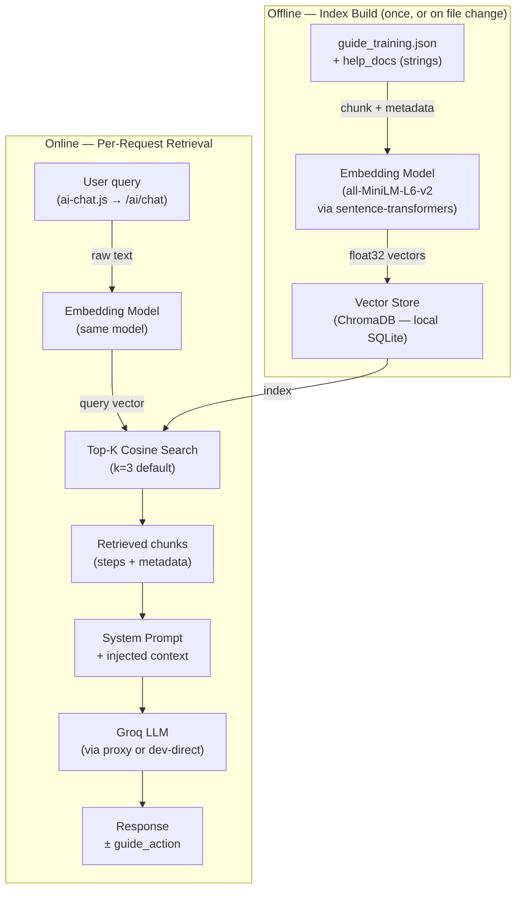
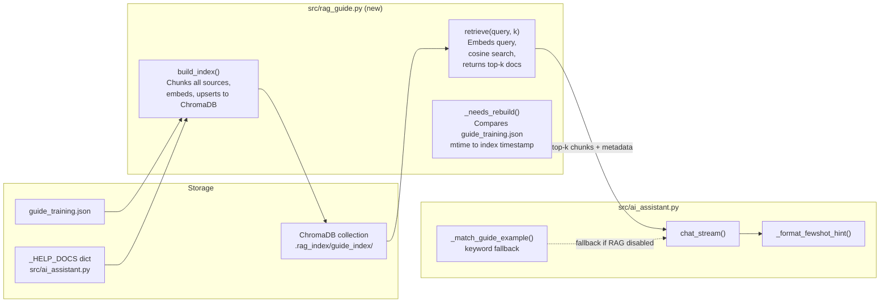
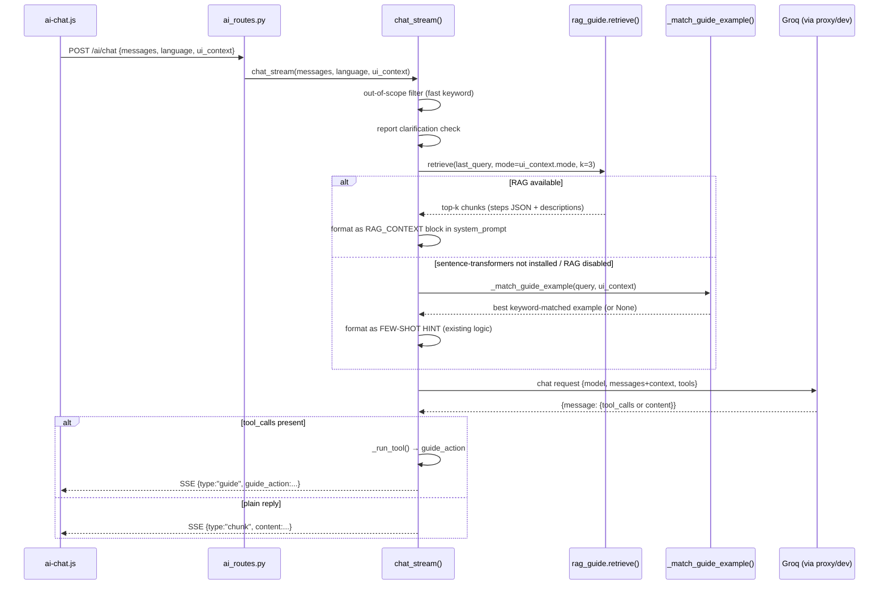

# RAG Architecture — Customized User Guide

## Purpose

This document describes the intended architecture for a **Retrieval-Augmented Generation (RAG)** system that powers the AI-guided user guide in Easy OKAPI. It serves as the reference for both human developers and future AI agents implementing or extending this subsystem.

---

## 1. Context: What Exists Today

The current system is a **keyword-based few-shot injection** pipeline. When a user asks a navigation question, the backend does a fast substring scan against `guide_training.json` and injects a matched example as a few-shot hint into the LLM system prompt.

```
┌────────────────────┐
│  guide_training.json│  ← hand-authored examples
│  [{queries:[...],  │     each has keyword list + step array
│    steps:[...]}]   │
└────────┬───────────┘
         │ substring scan (O(n × keywords))
         ▼
┌────────────────────┐
│ _match_guide_example│  src/ai_assistant.py:25
│  score = Σ(kw ∈ q) │
│  mode conditions   │
└────────┬───────────┘
         │ best-matching example
         ▼
┌────────────────────┐
│  System prompt     │
│  + FEW-SHOT HINT   │  injected verbatim
└────────────────────┘
```

**Limitations of the current approach:**
- Only matches if the user uses exact vocabulary from the `queries` list.
- Paraphrases ("walk me through exporting"), multilingual variants, or combined questions return no match.
- Adding new guide topics requires manually listing every possible keyword.

---

## 2. Proposed: RAG Pipeline

The RAG system replaces (or augments as a fallback) the keyword scan with **semantic vector search**. Both the query and the guide knowledge base are embedded into the same vector space; retrieval finds semantically similar entries regardless of exact wording.

### 2.1 High-Level Data Flow



### 2.2 Detailed Component Map



---

## 3. Knowledge Base Schema

Each document in the vector store is a **chunk** with text and structured metadata.

### 3.1 Chunk types

| Source | chunk `text` | Metadata fields |
|---|---|---|
| `guide_training.json` example | `queries[0]` + step titles + descriptions (concatenated) | `type="guide_example"`, `id`, `conditions` (JSON-serialised), `steps` (JSON-serialised) |
| `_HELP_DOCS` entry | topic key + doc text | `type="help_doc"`, `topic` |
| UI element descriptions | element ID + description from step definitions | `type="ui_element"`, `target_id` |

### 3.2 Metadata filtering

ChromaDB `where` clauses allow pre-filtering before cosine search:
- `conditions.mode` → pass current mode as a filter to exclude incompatible examples.
- `type` → retrieve only `guide_example` chunks when a guide tool call is expected.

---

## 4. Module Design: `src/rag_guide.py`

```python
# Public API consumed by ai_assistant.py

def ensure_index() -> None:
    """Build or rebuild the ChromaDB index if guide_training.json changed."""

def retrieve(query: str, mode: str = "", k: int = 3) -> list[dict]:
    """
    Embed query, search collection, return top-k results.
    Each result: {"text": ..., "metadata": ..., "distance": float}
    """
```

### 4.1 Index persistence

```
microalbumin-Flask/
└── .rag_index/
    └── guide_index/          ← ChromaDB persistent directory
        ├── chroma.sqlite3
        └── ...
```

`.rag_index/` is gitignored (auto-regenerated). Index is rebuilt when `guide_training.json` mtime changes or on first run.

### 4.2 Embedding model

**`all-MiniLM-L6-v2`** via `sentence-transformers` — runs locally, no external API call, no server dependency.

| Property | Value |
|---|---|
| Library | `sentence-transformers` |
| Latency (per query) | ~10–30 ms |
| Vector dimension | 384 |
| Install | `pip install sentence-transformers` |

**Fallback:** If `sentence-transformers` is not installed (embedding fails), `rag_guide.retrieve()` raises `EmbeddingUnavailableError`; `chat_stream()` falls back to `_match_guide_example()`.

---

## 5. Integration into `chat_stream()`



### 5.1 RAG context injection format

The retrieved chunks are injected into the system prompt as a structured block **before** the few-shot hint section:

```
[RETRIEVED GUIDE CONTEXT]
1. Topic: "how to export coefficients"
   Steps: [{"target":"#export-coef","title":"Export Coefficients",...}, ...]
   Conditions: {"mode_in":["calibrate"]}

2. Topic: "export analysis data"
   Steps: [{"target":"#export-analysis","title":"Export Analysis",...}, ...]
   Conditions: {}

When the user's question matches one of the above, prefer those exact steps for trigger_custom_steps.
[END CONTEXT]
```

---

## 6. Settings Integration

RAG settings are added to `ai_settings.json` and managed via `src/ai_settings.py`.

```json
{
  "rag_enabled": true,
  "rag_top_k": 3,
  "rag_score_threshold": 0.35
}
```

`rag_score_threshold`: retrieved chunks whose cosine distance exceeds this value are discarded (prevents injecting irrelevant context for very off-topic queries).

---

## 7. File Change Summary

| File | Change |
|---|---|
| `src/rag_guide.py` | **New** — index build, retrieval, embedding calls |
| `src/ai_assistant.py` | Import `rag_guide`; wrap `_match_guide_example` in RAG-first logic inside `chat_stream` |
| `src/ai_settings.py` | Add `rag_enabled`, `rag_top_k`, `rag_score_threshold` defaults |
| `requirements.txt` | Add `chromadb`, `sentence-transformers` |
| `easyokapi-knowledge/EASY OKAPI.md` | Add `rag_guide.py` to module table; add RAG settings to section 5.6 |
| `Rule.md` | Add RAG coding rules (index path, fallback behaviour) |
| `.gitignore` | Add `.rag_index/` |

---

## 8. Constraints

- **Embedding is local.** `sentence-transformers` runs on the user's machine — no cloud embedding API.
- **LLM calls go through the existing Groq proxy.** No new AI service is introduced.
- **No SocketIO / streaming from the index build.** Index build runs synchronously at startup (or lazily on first query); progress is logged, not streamed.
- **Single-user.** No concurrency locking needed for the vector store beyond what ChromaDB provides internally.
- **Static serving only.** No changes to JS bundle; all RAG logic is server-side Python.
- **Graceful degradation.** If `chromadb` or `sentence-transformers` is not installed, the system must fall back silently to keyword matching — never crash.

---

## 9. Phased Implementation Plan

| Phase | Deliverable | Status |
|---|---|---|
| 0 | This architecture document | ✅ Done |
| 1 | `src/rag_guide.py` — index build + sentence-transformers embed | ⬜ Pending |
| 2 | Integrate into `chat_stream()` with fallback | ⬜ Pending |
| 3 | `ai_settings.py` + `ai_settings.json` RAG keys | ⬜ Pending |
| 4 | Settings UI in `ai-chat.js` (toggle RAG on/off) | ⬜ Pending |
| 5 | Evaluation: compare RAG vs keyword match on test queries | ⬜ Pending |
